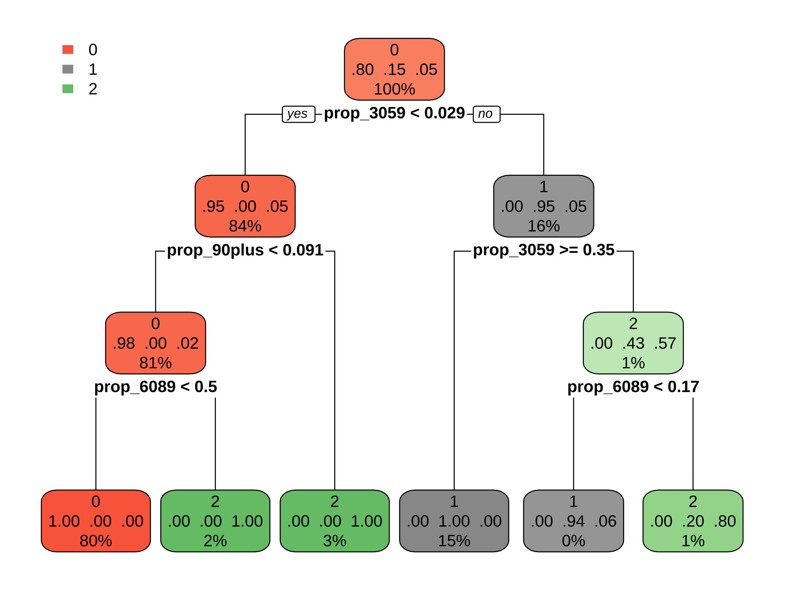

# Process Test Dataset


```r
if (!requireNamespace("readr", quietly = TRUE)) {install.packages("readr")}
if (!requireNamespace("rpart", quietly = TRUE)) {install.packages("rpart")}
if (!requireNamespace("rpart.plot", quietly = TRUE)) {install.packages("rpart.plot")}
if (!requireNamespace("dlookr", quietly = TRUE)) {install.packages("dlookr")}
if (!requireNamespace("tidyverse", quietly = TRUE)) {install.packages("tidyverse")}
if (!requireNamespace("conflicted", quietly = TRUE)) {install.packages("conflicted")}
if (!requireNamespace("ggcorrplot", quietly = TRUE)) {install.packages("ggcorrplot")}
if (!requireNamespace("patchwork", quietly = TRUE)) {install.packages("patchwork")}
library(readr)
library(rpart)
library(rpart.plot)
library(dlookr)
library(tidyverse)
library(conflicted)
conflicts_prefer("tidyr"::extract, "tidyr"::extract)
```

```
## [conflicted] Removing existing preference.
## [conflicted] Will prefer tidyr::extract over any other package.
## [conflicted] Removing existing preference.
## [conflicted] Will prefer tidyr::extract over any other package.
```

```r
conflicts_prefer("dplyr"::filter, "dplyr"::lag)
```

```
## [conflicted] Removing existing preference.
## [conflicted] Will prefer dplyr::filter over any other package.
## [conflicted] Removing existing preference.
## [conflicted] Will prefer dplyr::lag over any other package.
```

```r
library(ggcorrplot)
library(patchwork)
setwd("/Users/cailiying/Desktop/cuhk bsc/23:24/23:24 T2/STAT3011/Project2")
df = read_csv("cs-test.csv")
```

```
## New names:
## Rows: 101503 Columns: 12
## ── Column specification
## ───────────────────────────────────────────────────────────────────────────── Delimiter: "," dbl
## (11): ...1, RevolvingUtilizationOfUnsecuredLines, age, NumberOfTime30-59DaysPastDueNotWorse, ... lgl
## (1): SeriousDlqin2yrs
## ℹ Use `spec()` to retrieve the full column specification for this data. ℹ Specify the column types
## or set `show_col_types = FALSE` to quiet this message.
## • `` -> `...1`
```

```r
#Drop the column (Unnamed: 0)
df <- df[,-1]

#Clean the column names
colnames(df) <- gsub("-", "", tolower(colnames(df)))
```

# MISSING VALUES 


```r
colSums(is.na(df))
```

```
##                     seriousdlqin2yrs revolvingutilizationofunsecuredlines 
##                               101503                                    0 
##                                  age  numberoftime3059dayspastduenotworse 
##                                    0                                    0 
##                            debtratio                        monthlyincome 
##                                    0                                20103 
##      numberofopencreditlinesandloans              numberoftimes90dayslate 
##                                    0                                    0 
##         numberrealestateloansorlines  numberoftime6089dayspastduenotworse 
##                                    0                                    0 
##                   numberofdependents 
##                                 2626
```

```r
#Fill in the missing values of numberofdependents and calculate the average values according to age groups.
table(df$age)
```

```
## 
##   21   22   23   24   25   26   27   28   29   30   31   32   33   34   35   36   37   38   39   40 
##  147  280  434  537  638  752  931 1044 1118 1198 1376 1379 1457 1465 1561 1697 1611 1731 2012 2071 
##   41   42   43   44   45   46   47   48   49   50   51   52   53   54   55   56   57   58   59   60 
## 2114 2164 2164 2216 2426 2498 2531 2564 2551 2604 2489 2392 2492 2423 2311 2400 2286 2277 2220 2165 
##   61   62   63   64   65   66   67   68   69   70   71   72   73   74   75   76   77   78   79   80 
## 2429 2390 2527 2119 1670 1709 1614 1597 1336 1278 1194 1105  975  947  819  841  752  720  685  642 
##   81   82   83   84   85   86   87   88   89   90   91   92   93   94   95   96   97   98   99  100 
##  559  466  391  340  278  278  233  195  219  155  107   60   44   42   26   14   10    3    4    1 
##  101  104 
##    2    1
```

```r
#delete age=0, change age=21 to 22
df <- df[df$age != 0, ]
df$age[df$age == 21] <- 22
table(df$age)
```

```
## 
##   22   23   24   25   26   27   28   29   30   31   32   33   34   35   36   37   38   39   40   41 
##  427  434  537  638  752  931 1044 1118 1198 1376 1379 1457 1465 1561 1697 1611 1731 2012 2071 2114 
##   42   43   44   45   46   47   48   49   50   51   52   53   54   55   56   57   58   59   60   61 
## 2164 2164 2216 2426 2498 2531 2564 2551 2604 2489 2392 2492 2423 2311 2400 2286 2277 2220 2165 2429 
##   62   63   64   65   66   67   68   69   70   71   72   73   74   75   76   77   78   79   80   81 
## 2390 2527 2119 1670 1709 1614 1597 1336 1278 1194 1105  975  947  819  841  752  720  685  642  559 
##   82   83   84   85   86   87   88   89   90   91   92   93   94   95   96   97   98   99  100  101 
##  466  391  340  278  278  233  195  219  155  107   60   44   42   26   14   10    3    4    1    2 
##  104 
##    1
```

```r
#categorize age into five age_group: 20-29, 30-39, 40-49, 50-59, 60+
df$age_group<-cut(df$age, breaks = c(20, 30, 40, 50, 60, Inf), 
                  labels = c("20-29", "30-39", "40-49", "50-59", "60+"),
                  right = FALSE)
table(df$age_group)
```

```
## 
## 20-29 30-39 40-49 50-59   60+ 
##  5881 15487 23299 23894 32942
```

```r
#Calculate the average number of dependents for each age group
df_dependents <- df %>%
  group_by(age_group) %>%
  summarise(
    avg_number_of_dependents = round(mean(numberofdependents, na.rm = TRUE))
  )
print(df_dependents)
```

```
## # A tibble: 5 × 2
##   age_group avg_number_of_dependents
##   <fct>                        <dbl>
## 1 20-29                            0
## 2 30-39                            1
## 3 40-49                            1
## 4 50-59                            1
## 5 60+                              0
```

```r
#Merge the average values back into the original data frame
df <- df %>%
  left_join(df_dependents, by = "age_group") %>%
  mutate(
    numberofdependents = ifelse(is.na(numberofdependents), avg_number_of_dependents, 
                                numberofdependents),
  ) %>%
  #Remove the temporary average columns
  select(-avg_number_of_dependents) 
sum(is.na(df$numberofdependents))
```

```
## [1] 0
```

# OUTLIER DETECTION (for continuous variables)
Detect Outlier Methods: 1.IQR 2.Median Absolute Deviation (MAD) 3.Z-score


```r
IQR_based_outlier <- function(data) {
  stats <- boxplot.stats(data)
  return(data %in% stats$out)
}

mad_based_outlier <- function(data, thresh = 3.5){
  if (length(dim(data)) == 1) {
    data <- matrix(data, ncol = 1)
  }
  med <- median(data)
  mad <- median(abs(data - med))
  modified_z_scores <- 0.6745*(data-med)/mad
  return(modified_z_scores>thresh)
}

z_score_outlier<- function(data, threshold=1.96){
  std=sd(data)
  mean=mean(data)
  z <- abs(data - mean)/std
  return(z>threshold)
}

outlierVote <- function(data, mad_thresh = 3.5, z_score_thresh=1.96) {
  ibo <- IQR_based_outlier(data)
  mbo <- mad_based_outlier(data, mad_thresh)
  zso <- z_score_outlier(data, z_score_thresh)
  combined <- (ibo & mbo) | (ibo & zso) | (mbo & zso)
  return(combined)
}
```

Debtratio Outlier


```r
debtratio_outlier <- outlierVote(df$debtratio)
sum(debtratio_outlier)
```

```
## [1] 21018
```

```r
summary(df[debtratio_outlier==TRUE,"debtratio"])
```

```
##    debtratio        
##  Min.   :     1.87  
##  1st Qu.:   166.00  
##  Median :  1166.25  
##  Mean   :  1662.31  
##  3rd Qu.:  2384.00  
##  Max.   :268326.00
```

```r
summary(df[debtratio_outlier==FALSE,"debtratio"])
```

```
##    debtratio     
##  Min.   :0.0000  
##  1st Qu.:0.1308  
##  Median :0.2834  
##  Mean   :0.3332  
##  3rd Qu.:0.4579  
##  Max.   :1.8684
```

```r
# Replace the debtratio outlier
# all the debtratio outliers are above normal values, we use the max normal value to replace them
df[debtratio_outlier==TRUE, "debtratio"] <- max(df[debtratio_outlier==FALSE, "debtratio"])
summary(df$debtratio)
```

```
##    Min. 1st Qu.  Median    Mean 3rd Qu.    Max. 
##  0.0000  0.1734  0.3643  0.6511  0.8516  1.8684
```

Monthly income outlier


```r
# Since there exists missing values in monthlyincome, we fill them first
sum(is.na(df$monthlyincome))
```

```
## [1] 20103
```

```r
# There are two filling methods
# For debtratio outlier rows, fill monthlyincome values according to the average monthlyincome value of the high/low debtratio outlier groups
# Calculate the median of debtratio_outlier
median_debtratio_out <- median(df$debtratio[debtratio_outlier])
# High and Low debtratio group
low_debtratio_out <- df$debtratio < median_debtratio_out & debtratio_outlier
high_debtratio_out <- df$debtratio >= median_debtratio_out & debtratio_outlier
# Calculate the mean monthlyincome for high and low debtratio groups
avg_monthlyincome_out_low <- mean(df$monthlyincome[low_debtratio_out], na.rm = TRUE)
avg_monthlyincome_out_high <- mean(df$monthlyincome[high_debtratio_out], na.rm = TRUE)
# Fill in the missing values in the monthly income of the debt ratio outlier row
df$monthlyincome[is.na(df$monthlyincome) & low_debtratio_out] <- avg_monthlyincome_out_low
df$monthlyincome[is.na(df$monthlyincome) & high_debtratio_out] <- avg_monthlyincome_out_high

#For other missing value from monthlyincome, we fill them by the average monthlyincome values according to each age groups.
# calculate the average monthly income for each age group
df_monthlyincome <- df %>%
  group_by(age_group) %>%
  summarise(
    avg_monthly_income = mean(monthlyincome, na.rm = TRUE)
  )
print(df_monthlyincome)
```

```
## # A tibble: 5 × 2
##   age_group avg_monthly_income
##   <fct>                  <dbl>
## 1 20-29                  2675.
## 2 30-39                  4932.
## 3 40-49                  6392.
## 4 50-59                  6236.
## 5 60+                    5764.
```

```r
#Merge the average values back into the original data frame
df <- df %>%
  left_join(df_monthlyincome, by = "age_group") %>%
  mutate(
    monthlyincome = ifelse(is.na(monthlyincome), avg_monthly_income, monthlyincome)
  ) %>%
  #Remove the temporary average columns
  select(-avg_monthly_income) 
sum(is.na(df$monthlyincome))
```

```
## [1] 0
```

```r
# Detect monthly income outlier
monthlyincome_outlier <- outlierVote(df$monthlyincome)
sum(monthlyincome_outlier)
```

```
## [1] 1868
```

```r
summary(df[monthlyincome_outlier==FALSE,"monthlyincome"])
```

```
##  monthlyincome  
##  Min.   :    0  
##  1st Qu.: 1790  
##  Median : 4399  
##  Mean   : 4975  
##  3rd Qu.: 7100  
##  Max.   :18756
```

```r
summary(df[monthlyincome_outlier==TRUE,"monthlyincome"])
```

```
##  monthlyincome    
##  Min.   :  18778  
##  1st Qu.:  20654  
##  Median :  24900  
##  Mean   :  45107  
##  3rd Qu.:  35000  
##  Max.   :7727000
```

```r
# all the monthlyincome outliers are above normal values, we use the max normal value to replace them
df[monthlyincome_outlier==TRUE, "monthlyincome"] <- max(df[monthlyincome_outlier==FALSE, "monthlyincome"])
summary(df$monthlyincome)
```

```
##    Min. 1st Qu.  Median    Mean 3rd Qu.    Max. 
##       0    1854    4500    5228    7374   18756
```

revolvingutilizationofunsecuredlines outlier


```r
revolvingutilizationofunsecuredlines_outlier <- outlierVote(df$revolvingutilizationofunsecuredlines)
sum(revolvingutilizationofunsecuredlines_outlier)
```

```
## [1] 493
```

```r
summary(df[revolvingutilizationofunsecuredlines_outlier==FALSE,"revolvingutilizationofunsecuredlines"])
```

```
##  revolvingutilizationofunsecuredlines
##  Min.   :0.00000                     
##  1st Qu.:0.02984                     
##  Median :0.15041                     
##  Mean   :0.31804                     
##  3rd Qu.:0.55508                     
##  Max.   :1.36502
```

```r
summary(df[revolvingutilizationofunsecuredlines_outlier==TRUE,"revolvingutilizationofunsecuredlines"])
```

```
##  revolvingutilizationofunsecuredlines
##  Min.   :    1.366                   
##  1st Qu.:    1.587                   
##  Median :    1.994                   
##  Mean   : 1028.105                   
##  3rd Qu.:  515.000                   
##  Max.   :21821.000
```

```r
# all the revolvingutilizationofunsecuredlines outliers are above normal values, we use the max normal value to replace them
df[revolvingutilizationofunsecuredlines_outlier==TRUE, "revolvingutilizationofunsecuredlines"] <- max(df[revolvingutilizationofunsecuredlines_outlier==FALSE, "revolvingutilizationofunsecuredlines"])
summary(df$revolvingutilizationofunsecuredlines)
```

```
##    Min. 1st Qu.  Median    Mean 3rd Qu.    Max. 
## 0.00000 0.03013 0.15259 0.32313 0.56423 1.36502
```

# Process variables
Process the three variables 'numberoftime3059dayspastduenotworse', 'numberoftime6089dayspastduenotworse', 'numberoftimes90dayslate'


```r
# Using Decision tree
#Calculate the total number of past due occurrences and proportion of each of tree pastduedate variable
#Create a new column 'category_pastdue' to store the classification
total_past_due <-  df['numberoftime3059dayspastduenotworse'] + 
  df['numberoftime6089dayspastduenotworse'] + df['numberoftimes90dayslate']

df$prop_3059 <- apply(df[, c('numberoftime3059dayspastduenotworse', 
                             'numberoftime6089dayspastduenotworse', 
                             'numberoftimes90dayslate')], 1, function(x) {
                               # Calculate the total number of past due occurrences
                               total_past_due <- sum(x['numberoftime3059dayspastduenotworse'],
                                                     x['numberoftime6089dayspastduenotworse'],
                                                     x['numberoftimes90dayslate'])
                               
                               # Calculate the proportion for each time frame
                               prop_3059 <- ifelse(is.na(x['numberoftime3059dayspastduenotworse'] / total_past_due), 0, 
                                                   x['numberoftime3059dayspastduenotworse'] / total_past_due)
                             })

df$prop_6089 <- apply(df[, c('numberoftime3059dayspastduenotworse', 
                             'numberoftime6089dayspastduenotworse', 
                             'numberoftimes90dayslate')], 1, function(x) {
                               # Calculate the total number of past due occurrences
                               total_past_due <- sum(x['numberoftime3059dayspastduenotworse'],
                                                     x['numberoftime6089dayspastduenotworse'],
                                                     x['numberoftimes90dayslate'])
                               
                               # Calculate the proportion for each time frame
                               prop_6089 <- ifelse(is.na(x['numberoftime6089dayspastduenotworse'] / total_past_due), 0, 
                                                   x['numberoftime6089dayspastduenotworse'] / total_past_due)
                             })

df$prop_90plus <- apply(df[, c('numberoftime3059dayspastduenotworse', 
                               'numberoftime6089dayspastduenotworse', 
                               'numberoftimes90dayslate')], 1, function(x) {
                                 # Calculate the total number of past due occurrences
                                 total_past_due <- sum(x['numberoftime3059dayspastduenotworse'],
                                                       x['numberoftime6089dayspastduenotworse'],
                                                       x['numberoftimes90dayslate'])
                                 
                                 # Calculate the proportion for each time frame
                                 prop_6089 <- ifelse(is.na(x['numberoftimes90dayslate'] / total_past_due), 0, 
                                                     x['numberoftimes90dayslate'] / total_past_due)
                               })


# assign new label
df$label <- ifelse(df$prop_3059 == 0 & df$prop_6089 == 0 & df$prop_90plus == 0, 0,
                   ifelse(df$prop_3059 > df$prop_6089 | df$prop_3059 > df$prop_90plus, 1, 2))
df$label <- as.factor(df$label)
# plot random forest
model <- rpart(label ~ prop_3059 + prop_6089 + prop_90plus, data = df)
par(mar = c(1, 1, 1, 1))
rpart.plot(model)
```



```r
df$category_pastdue <- apply(df[, c('numberoftime3059dayspastduenotworse', 
                                    'numberoftime6089dayspastduenotworse', 
                                    'numberoftimes90dayslate')], 1, function(x) {
                                      #Calculate the total number of past due occurrences
                                      total_past_due <- x['numberoftime3059dayspastduenotworse'] + 
                                        x['numberoftime6089dayspastduenotworse'] + x['numberoftimes90dayslate']
                                      #Calculate the proportion for each time frame
                                      prop_3059 <- ifelse(is.na(x['numberoftime3059dayspastduenotworse'] / total_past_due), 0, 
                                                          x['numberoftime3059dayspastduenotworse'] / total_past_due)
                                      prop_6089 <- ifelse(is.na(x['numberoftime6089dayspastduenotworse'] / total_past_due), 0, 
                                                          x['numberoftime6089dayspastduenotworse'] / total_past_due)
                                      prop_90plus <- ifelse(is.na(x['numberoftimes90dayslate'] / total_past_due), 0, 
                                                            x['numberoftimes90dayslate'] / total_past_due)
                                      if (prop_3059 < 0.029) {
                                        if (prop_90plus < 0.091) {
                                          if (prop_6089 < 0.5) {
                                            return(0)
                                          } else {
                                            return(2)
                                          }
                                        } else {
                                          return(2)
                                        }
                                      } else {
                                        if (prop_3059 >= 0.35) {
                                          return(1)
                                        } else {
                                          if (prop_6089 < 0.17) {
                                            return(1)
                                          } else {
                                            return(2)
                                          }
                                        }
                                      }
                                    })
df$category_pastdue <- as.factor(df$category_pastdue)
table(df$category_pastdue)
```

```
## 
##     0     1     2 
## 80778 15414  5311
```

```r
#remove three original columns and label column
df <- subset(df, select = -c(label, numberoftime3059dayspastduenotworse, numberoftime6089dayspastduenotworse, numberoftimes90dayslate))
```

Process "numberofdependents"


```r
summary(df$numberofdependents)
```

```
##    Min. 1st Qu.  Median    Mean 3rd Qu.    Max. 
##  0.0000  0.0000  0.0000  0.7582  1.0000 43.0000
```

```r
table(df$numberofdependents)
```

```
## 
##     0     1     2     3     4     5     6     7     8     9    10    20    43 
## 60328 18534 13298  6623  1995   526   125    50    16     3     3     1     1
```

```r
df$dependents_groups <- cut(df$numberofdependents,
                            breaks = c(0, 1, 2, 3, Inf),
                            labels = c("0", "1", "2", "3+"),
                            right = FALSE)
table(df$dependents_groups)
```

```
## 
##     0     1     2    3+ 
## 60328 18534 13298  9343
```

Process numberrealestateloansorlines


```r
summary(df$numberrealestateloansorlines)
```

```
##    Min. 1st Qu.  Median    Mean 3rd Qu.    Max. 
##   0.000   0.000   1.000   1.013   2.000  37.000
```

```r
table(df$numberrealestateloansorlines)
```

```
## 
##     0     1     2     3     4     5     6     7     8     9    10    11    12    13    14    15 
## 38066 35670 20955  4423  1414   452   227   108    58    49    23    19    11     5     9     4 
##    16    18    19    20    21    25    29    37 
##     2     1     2     1     1     1     1     1
```

```r
df$rsll_groups <- cut(df$numberrealestateloansorlines, 
                      breaks = c(0, 1, 2, 3,Inf),
                      labels = c("0", "1", "2", "3+"),
                      right = FALSE)
table(df$rsll_groups)
```

```
## 
##     0     1     2    3+ 
## 38066 35670 20955  6812
```

Process numberofopencreditlinesandloans


```r
summary(df$numberofopencreditlinesandloans)
```

```
##    Min. 1st Qu.  Median    Mean 3rd Qu.    Max. 
##   0.000   5.000   8.000   8.454  11.000  85.000
```

```r
table(df$numberofopencreditlinesandloans)
```

```
## 
##    0    1    2    3    4    5    6    7    8    9   10   11   12   13   14   15   16   17   18   19 
## 1250 3047 4457 6168 7779 8727 9217 9108 8469 7537 6721 5667 4708 3784 3079 2490 1984 1568 1281 1006 
##   20   21   22   23   24   25   26   27   28   29   30   31   32   33   34   35   36   37   38   39 
##  757  590  436  372  280  219  191  118   99   70   54   58   47   45   23   17   14    8   13    4 
##   40   41   42   43   44   45   46   47   48   49   51   52   53   58   63   85 
##    7    4    4    3    6    6    1    2    1    1    1    1    1    1    1    1
```

```r
df$ocll_quantile_groups <- cut(df$numberofopencreditlinesandloans, 
                               breaks = c(0,5, 8, 11, Inf),
                               labels = c("0-4", "5-7", "8-10", "11+"),
                               right = FALSE)
table(df$ocll_quantile_groups)
```

```
## 
##   0-4   5-7  8-10   11+ 
## 22701 27052 22727 29023
```

# Process Numeric Variables


```r
df$sqrt_debtratio <- sqrt(df$debtratio)
df$sqrt_monthlyincome <- sqrt(df$monthlyincome)
df$sqrt_revolvingutilizationofunsecuredlines <- sqrt(df$revolvingutilizationofunsecuredlines)
#remove three original columns
df <- subset(df, select = -c(debtratio, monthlyincome, revolvingutilizationofunsecuredlines))
```

# Convert categorical variables


```r
df$age_group <- as.factor(
  ifelse(df$age_group == "20-29", 1,
         ifelse(df$age_group == "30-39", 2,
                ifelse(df$age_group == "40-49", 3,
                       ifelse(df$age_group == "50-59", 4, 5)))))
table(df$age_group)
```

```
## 
##     1     2     3     4     5 
##  5881 15487 23299 23894 32942
```

```r
df$dependents_groups <- as.factor(
  ifelse(df$dependents_groups == "0", 0, 
         ifelse(df$dependents_groups == "1", 1,
                ifelse(df$dependents_groups == "2", 2, 3)))
)
table(df$dependents_groups)
```

```
## 
##     0     1     2     3 
## 60328 18534 13298  9343
```

```r
df$rsll_groups <- as.factor(
  ifelse(df$rsll_groups == "0", 0, 
         ifelse(df$rsll_groups == "1", 1,
                ifelse(df$rsll_groups == "2", 2, 3)))
)
table(df$rsll_groups)
```

```
## 
##     0     1     2     3 
## 38066 35670 20955  6812
```

```r
df$ocll_quantile_groups <- as.factor(
  ifelse(df$ocll_quantile_groups == "0-4", 0, 
         ifelse(df$ocll_quantile_groups == "5-7", 1,
                ifelse(df$ocll_quantile_groups == "8-10", 2, 3)))
)
table(df$ocll_quantile_groups)
```

```
## 
##     0     1     2     3 
## 22701 27052 22727 29023
```

```r
df$category_pastdue <- as.factor(df$category_pastdue)
```

# write in csv


```r
write.csv(df, file="cs-test-processed-v1.csv", row.names=FALSE)
```

