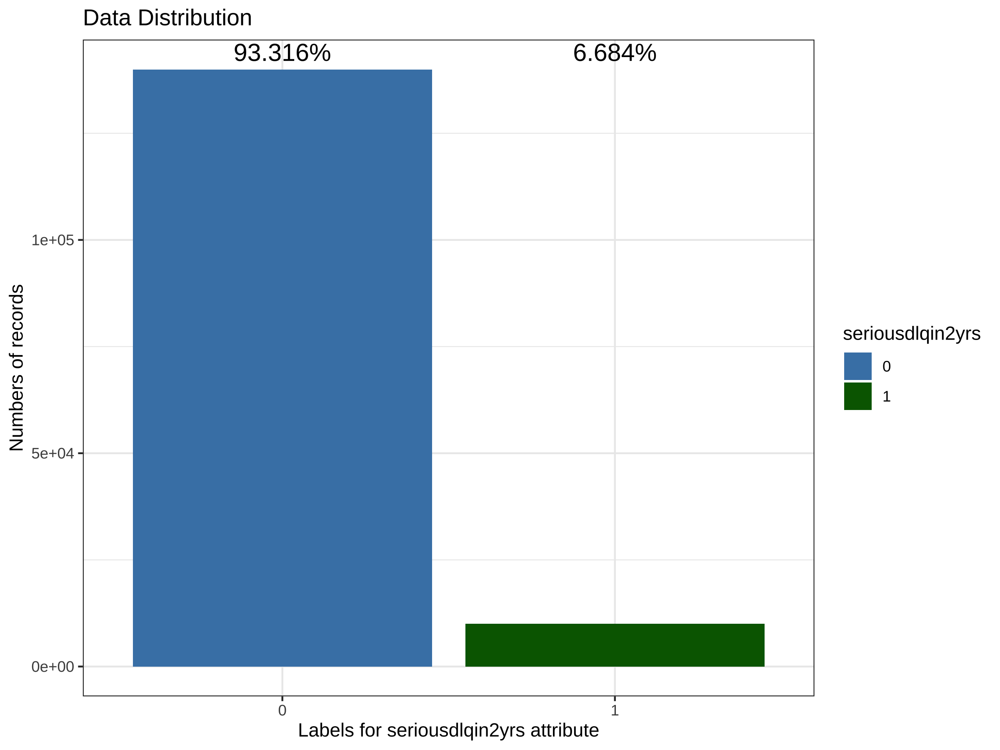
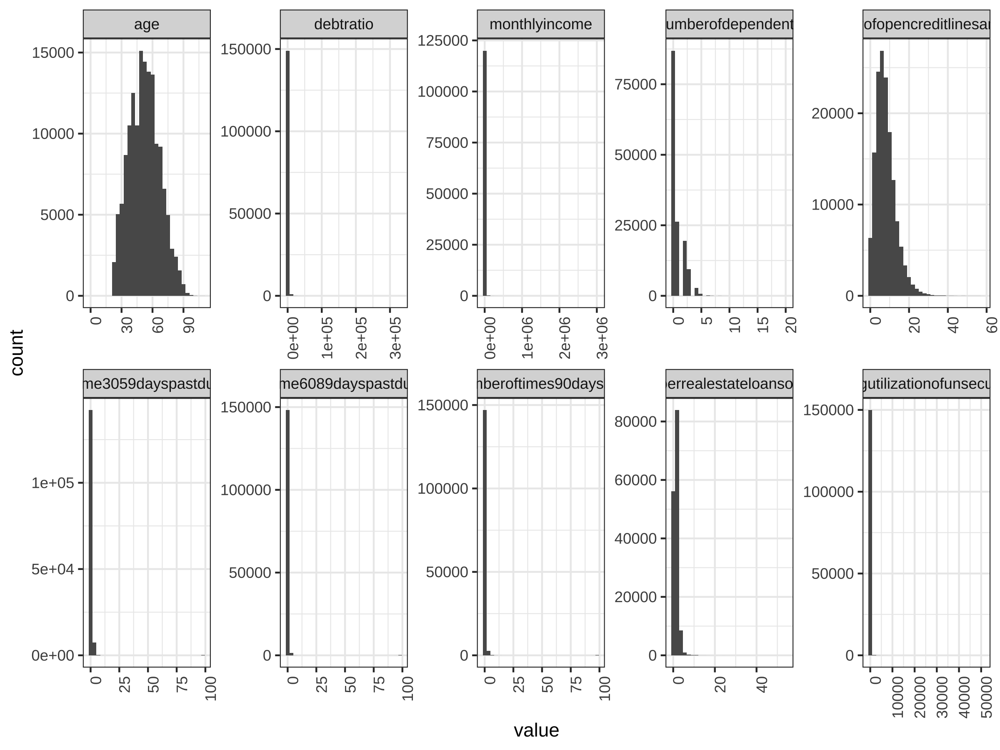
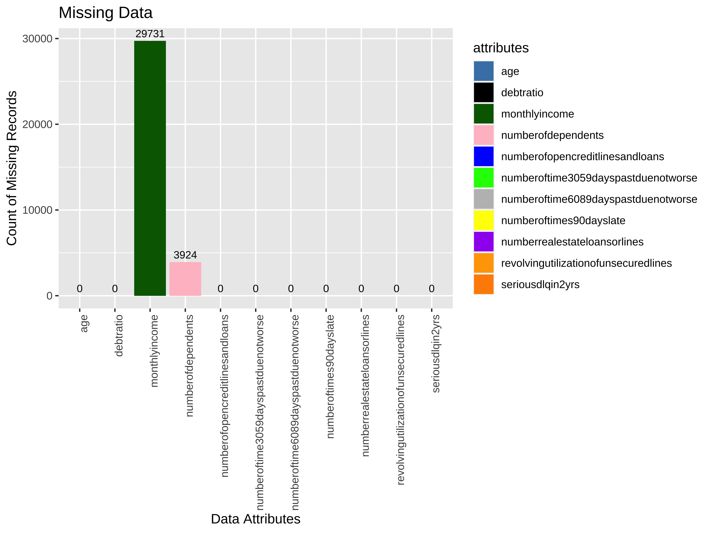
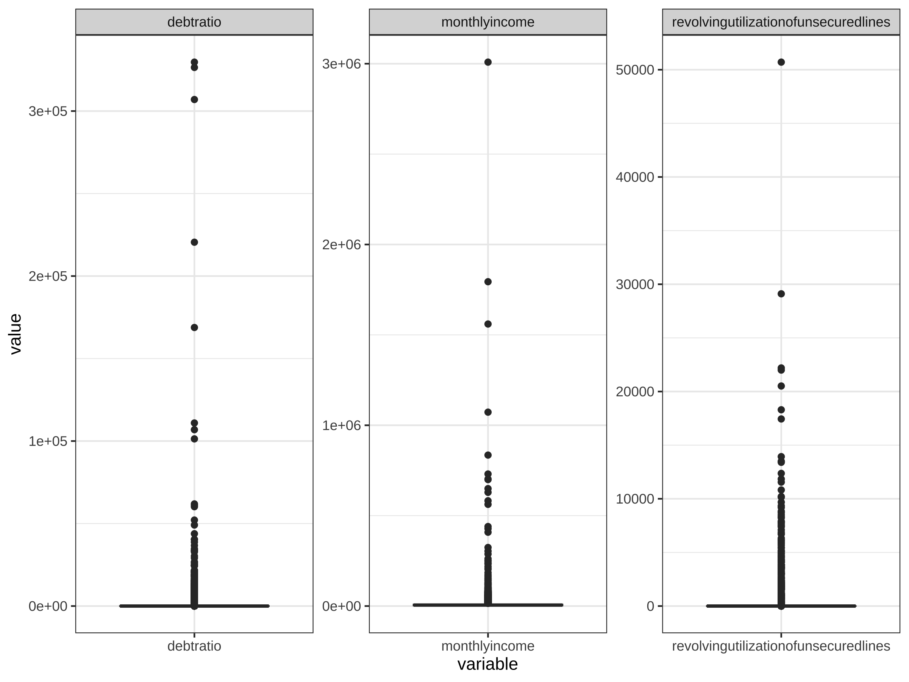
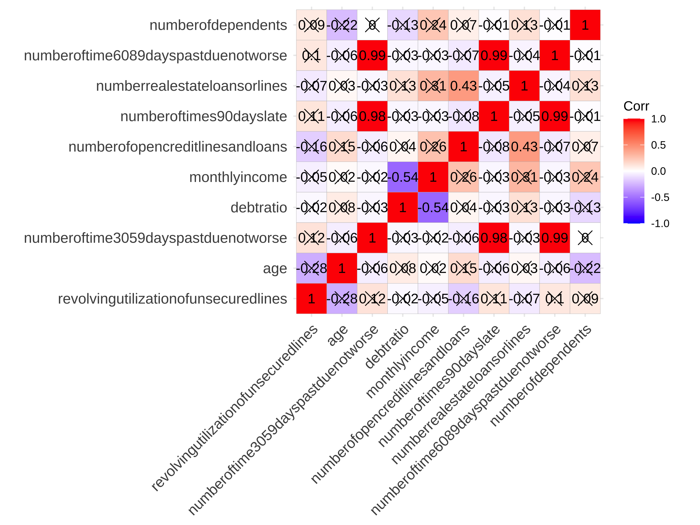
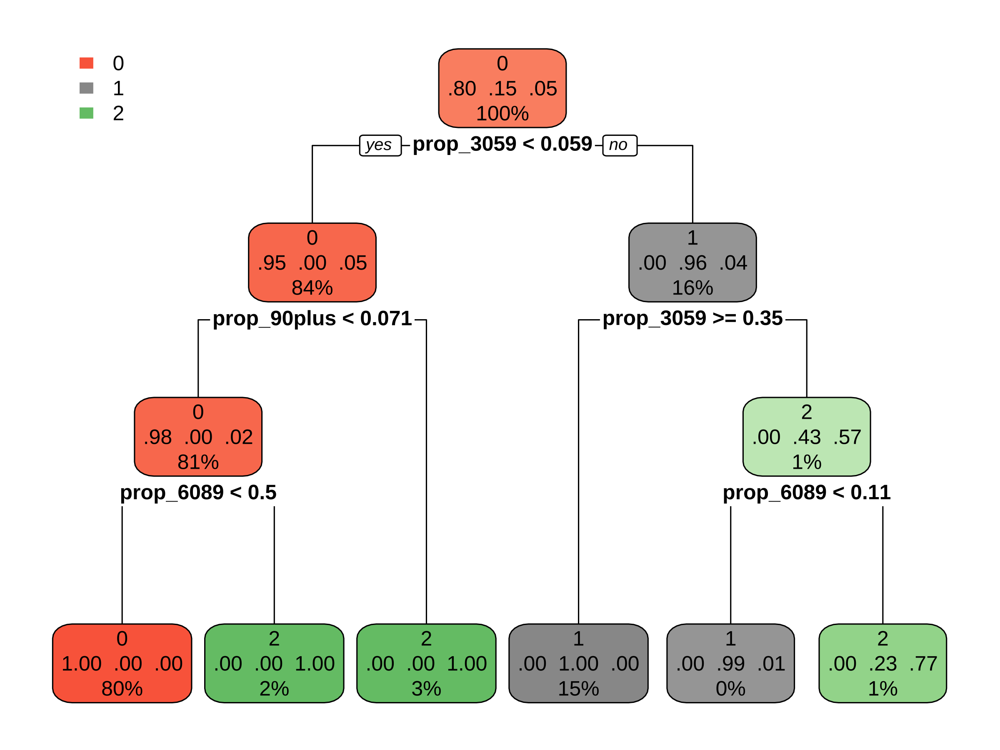
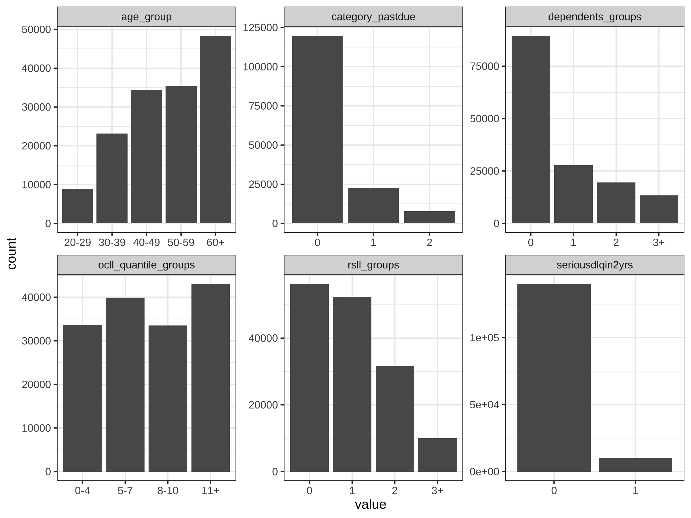
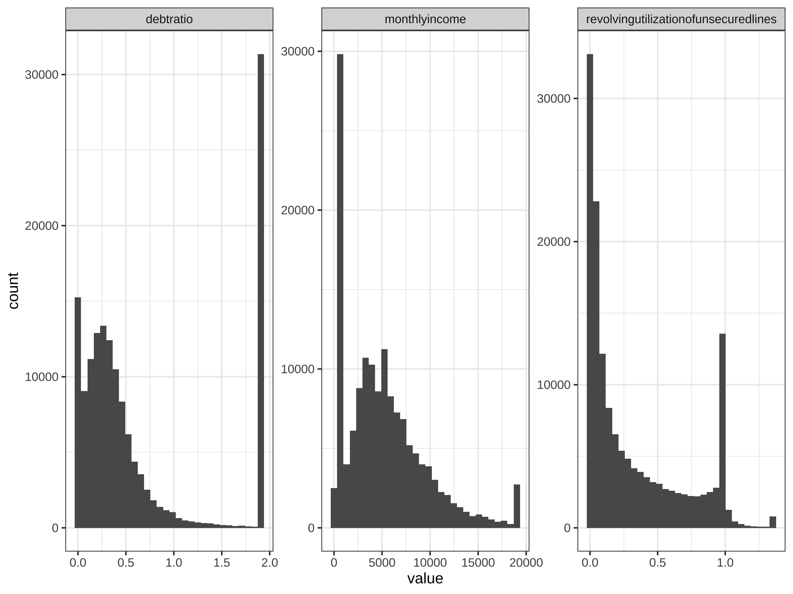

# Exploratory Data Analysis (EDA)


```r
setwd("/Users/cailiying/Desktop/cuhk bsc/23:24/23:24 T2/STAT3011/Project2")
library(dlookr)
library(tidyverse)
library(ggcorrplot)
library(patchwork)
```

# Descriptive Statistics


```r
#Computes the statistics of all numerical variables 
#describe(df)
#In SQL
library(RSQL) #Generate and Process 'SQL' Queries in R
library(RSQLite)
con <- dbConnect(drv = RSQLite::SQLite(),
                 dbname = ":memory:")
dbListTables(con)
```

```
## character(0)
```

```r
training_data = read.csv("cs-training.csv")
#Drop the column (Unnamed: 0)
training_data <- training_data[,-1]

#Clean the column names
colnames(training_data) <- gsub("[-,.]", "", tolower(colnames(training_data)))
head(training_data)
```

```
##   seriousdlqin2yrs revolvingutilizationofunsecuredlines age numberoftime3059dayspastduenotworse
## 1                1                            0.7661266  45                                   2
## 2                0                            0.9571510  40                                   0
## 3                0                            0.6581801  38                                   1
## 4                0                            0.2338098  30                                   0
## 5                0                            0.9072394  49                                   1
## 6                0                            0.2131787  74                                   0
##    debtratio monthlyincome numberofopencreditlinesandloans numberoftimes90dayslate
## 1 0.80298213          9120                              13                       0
## 2 0.12187620          2600                               4                       0
## 3 0.08511338          3042                               2                       1
## 4 0.03604968          3300                               5                       0
## 5 0.02492570         63588                               7                       0
## 6 0.37560697          3500                               3                       0
##   numberrealestateloansorlines numberoftime6089dayspastduenotworse numberofdependents
## 1                            6                                   0                  2
## 2                            0                                   0                  1
## 3                            0                                   0                  0
## 4                            0                                   0                  0
## 5                            1                                   0                  0
## 6                            1                                   0                  1
```

```r
#Load the table
dbWriteTable(conn = con, 
             name = "training_data",
             value = training_data)
describe  =  DBI::dbGetQuery(conn = con,
                             statement = "
                SELECT 'revolvingutilizationofunsecuredlines' AS variable,
                       COUNT(revolvingutilizationofunsecuredlines) AS count,
                       AVG(revolvingutilizationofunsecuredlines) AS mean,
                       STDEV(revolvingutilizationofunsecuredlines) AS std,
                       MIN(revolvingutilizationofunsecuredlines) AS min,
                       MAX(revolvingutilizationofunsecuredlines) AS max
                FROM training_data
                UNION ALL
                SELECT 'age' AS variable,
                       COUNT(age) AS count,
                       AVG(age) AS mean,
                       STDEV(age) AS std,
                       MIN(age) AS min,
                       MAX(age) AS max
                FROM training_data
                UNION ALL
                SELECT 'numberoftime3059dayspastduenotworse' AS variable,
                       COUNT(numberoftime3059dayspastduenotworse) AS count,
                       AVG(numberoftime3059dayspastduenotworse) AS mean,
                       STDEV(numberoftime3059dayspastduenotworse) AS std,
                       MIN(numberoftime3059dayspastduenotworse) AS min,
                       MAX(numberoftime3059dayspastduenotworse) AS max
                FROM training_data
                UNION ALL
                SELECT 'debtratio' AS variable,
                       COUNT(debtratio) AS count,
                       AVG(debtratio) AS mean,
                       STDEV(debtratio) AS std,
                       MIN(debtratio) AS min,
                       MAX(debtratio) AS max
                FROM training_data
                UNION ALL
                SELECT 'monthlyincome' AS variable,
                       COUNT(monthlyincome) AS count,
                       AVG(monthlyincome) AS mean,
                       STDEV(monthlyincome) AS std,
                       MIN(monthlyincome) AS min,
                       MAX(monthlyincome) AS max
                FROM training_data
                UNION ALL
                SELECT 'numberofopencreditlinesandloans' AS variable,
                       COUNT(numberofopencreditlinesandloans) AS count,
                       AVG(numberofopencreditlinesandloans) AS mean,
                       STDEV(numberofopencreditlinesandloans) AS std,
                       MIN(numberofopencreditlinesandloans) AS min,
                       MAX(numberofopencreditlinesandloans) AS max
                FROM training_data
                UNION ALL 
                SELECT 'numberoftimes90dayslate' AS variable,
                       COUNT(numberoftimes90dayslate) AS count,
                       AVG(numberoftimes90dayslate) AS mean,
                       STDEV(numberoftimes90dayslate) AS std,
                       MIN(numberoftimes90dayslate) AS min,
                       MAX(numberoftimes90dayslate) AS max
                FROM training_data
                UNION ALL
                SELECT 'numberrealestateloansorlines' AS variable,
                       COUNT(numberrealestateloansorlines) AS count,
                       AVG(numberrealestateloansorlines) AS mean,
                       STDEV(numberrealestateloansorlines) AS std,
                       MIN(numberrealestateloansorlines) AS min,
                       MAX(numberrealestateloansorlines) AS max
                FROM training_data
                UNION ALL
                SELECT 'numberoftime6089dayspastduenotworse' AS variable,
                       COUNT(numberoftime6089dayspastduenotworse) AS count,
                       AVG(numberoftime6089dayspastduenotworse) AS mean,
                       STDEV(numberoftime6089dayspastduenotworse) AS std,
                       MIN(numberoftime6089dayspastduenotworse) AS min,
                       MAX(numberoftime6089dayspastduenotworse) AS max
                FROM training_data
                UNION ALL
                SELECT 'numberofdependents' AS variable,
                       COUNT(numberofdependents) AS count,
                       AVG(numberofdependents) AS mean,
                       STDEV(numberofdependents) AS std,
                       MIN(numberofdependents) AS min,
                       MAX(numberofdependents) AS max
                FROM training_data
                ")
describe=as.matrix(describe)
#calculate percentiles
percentiles <- apply(training_data, 2, quantile, probs = c(0.25, 0.50, 0.75), na.rm = TRUE)
percentiles = percentiles[,2:11]
a=t(percentiles)
describe=cbind(a,describe)
#descriptive analysis
describe
```

```
##                                      25%             50%           75%            
## revolvingutilizationofunsecuredlines "0.029867442"   "0.154180737" "0.5590462475" 
## age                                  "41"            "52"          "63"           
## numberoftime3059dayspastduenotworse  "0"             "0"           "0"            
## debtratio                            "0.17507383225" "0.366507841" "0.86825377325"
## monthlyincome                        "3400"          "5400"        "8249"         
## numberofopencreditlinesandloans      "5"             "8"           "11"           
## numberoftimes90dayslate              "0"             "0"           "0"            
## numberrealestateloansorlines         "0"             "1"           "2"            
## numberoftime6089dayspastduenotworse  "0"             "0"           "0"            
## numberofdependents                   "0"             "0"           "1"            
##                                      variable                               count    mean          
## revolvingutilizationofunsecuredlines "revolvingutilizationofunsecuredlines" "150000" "   6.0484381"
## age                                  "age"                                  "150000" "  52.2952067"
## numberoftime3059dayspastduenotworse  "numberoftime3059dayspastduenotworse"  "150000" "   0.4210333"
## debtratio                            "debtratio"                            "150000" " 353.0050758"
## monthlyincome                        "monthlyincome"                        "120269" "6670.2212374"
## numberofopencreditlinesandloans      "numberofopencreditlinesandloans"      "150000" "   8.4527600"
## numberoftimes90dayslate              "numberoftimes90dayslate"              "150000" "   0.2659733"
## numberrealestateloansorlines         "numberrealestateloansorlines"         "150000" "   1.0182400"
## numberoftime6089dayspastduenotworse  "numberoftime6089dayspastduenotworse"  "150000" "   0.2403867"
## numberofdependents                   "numberofdependents"                   "146076" "   0.7572223"
##                                      std            min max      
## revolvingutilizationofunsecuredlines "  249.755371" "0" "  50708"
## age                                  "   14.771866" "0" "    109"
## numberoftime3059dayspastduenotworse  "    4.192781" "0" "     98"
## debtratio                            " 2037.818523" "0" " 329664"
## monthlyincome                        "14384.674215" "0" "3008750"
## numberofopencreditlinesandloans      "    5.145951" "0" "     58"
## numberoftimes90dayslate              "    4.169304" "0" "     98"
## numberrealestateloansorlines         "    1.129771" "0" "     54"
## numberoftime6089dayspastduenotworse  "    4.155179" "0" "     98"
## numberofdependents                   "    1.115086" "0" "     20"
```

```r
#Read the CSV file
df <- read_csv("cs-training.csv")
```

```
## New names:
## Rows: 150000 Columns: 12
## ── Column specification
## ────────────────────────────────────────────────────────────────────────────────── Delimiter: "," dbl
## (12): ...1, SeriousDlqin2yrs, RevolvingUtilizationOfUnsecuredLines, age, NumberOfTime30-59DaysPast...
## ℹ Use `spec()` to retrieve the full column specification for this data. ℹ Specify the column types or set
## `show_col_types = FALSE` to quiet this message.
## • `` -> `...1`
```

```r
#Drop the column (Unnamed: 0)
df <- df[,-1]

#Clean the column names
colnames(df) <- gsub("-", "", tolower(colnames(df)))
```

# Plot the distribution of target variable “seriousdlqin2yrs”


```r
#Calculate the total length of the training data
total_len <- length(df$seriousdlqin2yrs)

#Calculate the percentage of each category in the target label
percentage_labels <- prop.table(table(df$seriousdlqin2yrs)) * 100
#Print the percentage labels
print(percentage_labels)
```

```
## 
##      0      1 
## 93.316  6.684
```

```r
library(ggplot2)
df$seriousdlqin2yrs <- as.factor(df$seriousdlqin2yrs)
#Define custom colors for each bar
bar_colors <- c("steelblue", "darkgreen")
#Create the countplot with different colors for each bar
plot <- ggplot(df, aes(x = seriousdlqin2yrs, fill = seriousdlqin2yrs)) +
  geom_bar() +
  scale_fill_manual(values = bar_colors) +
  labs(title = "Data Distribution",
       x = "Labels for seriousdlqin2yrs attribute",
       y = "Numbers of records") +
  theme_bw()
#Create a data frame with label values for each bar
label_data <- data.frame(
  seriousdlqin2yrs = levels(df$seriousdlqin2yrs),
  #Specify the label values for each bar as percentages
  label = c(93.316, 6.684) / 100  
)
#Compute the maximum bar height
max_height <- max(table(df$seriousdlqin2yrs))
#Add labels to the plot
plot_with_labels <- plot +
  geom_text(data = label_data,
            aes(label = paste0(label * 100, "%"), fill = seriousdlqin2yrs),
            y = max_height, vjust = -0.5, size = 5, position = position_stack(vjust = 0.5))
```

```
## Warning in geom_text(data = label_data, aes(label = paste0(label * 100, : Ignoring unknown aesthetics:
## fill
```

```r
#Display the plot
print(plot_with_labels)
```

```
## Warning: Stacking requires either the ymin and ymin or the y aesthetics
## ℹ Maybe you want `position = "identity"`?
```



Plot every variables


```r
df_numeric <- df %>% 
  ##select all numeric column
  select(where(is.numeric))

df_numeric %>% 
  pivot_longer(everything(),names_to = "variable",values_to = "value") %>% 
  ggplot(aes(x=value))+
  geom_histogram()+
  facet_wrap(~variable,scales = "free")+
  theme_bw()
```

```
## `stat_bin()` using `bins = 30`. Pick better value with `binwidth`.
```

```
## Warning: Removed 33655 rows containing non-finite values (`stat_bin()`).
```



```r
#Many variables are very unevenly distributed
```

# MISSING VALUES 


```r
#Calculate the count of missing values in each attribute
missing_counts <- colSums(is.na(df))

#Create a data frame with x and y values
missing_data <- data.frame(attributes = names(missing_counts),
                           missing_count = missing_counts)

#Create the bar plot
bar_colors <- c("steelblue","black","darkgreen", "pink","blue","green","grey","yellow","purple","orange","darkorange")
plot <- ggplot(missing_data, aes(x = attributes, y = missing_count, fill = attributes)) +
  geom_bar(stat = "identity") +
  scale_fill_manual(values = bar_colors) +
  labs(title = "Missing Data",
       x = "Data Attributes",
       y = "Count of Missing Records") +
  #Rotate x-axis labels if needed
  theme(axis.text.x = element_text(angle = 90, hjust = 1))  

#Add labels to the plot
plot_with_labels <- plot +
  geom_text(aes(label = missing_count), vjust = -0.5, size = 3)
#Display the plot
print(plot_with_labels)
```



```r
#There are two variables "monthly income" and "number of dependents" with missing values.

#Fill in the missing values of these two variables and calculate their average values according to age groups.
table(df$age)
```

```
## 
##    0   21   22   23   24   25   26   27   28   29   30   31   32   33   34   35   36   37   38   39   40 
##    1  183  434  641  816  953 1193 1338 1560 1702 1937 2038 2050 2239 2155 2246 2379 2521 2631 2987 3093 
##   41   42   43   44   45   46   47   48   49   50   51   52   53   54   55   56   57   58   59   60   61 
## 3122 3082 3208 3294 3502 3714 3719 3806 3837 3753 3627 3609 3648 3561 3416 3589 3375 3443 3280 3258 3522 
##   62   63   64   65   66   67   68   69   70   71   72   73   74   75   76   77   78   79   80   81   82 
## 3568 3719 3058 2594 2494 2503 2235 1954 1777 1646 1649 1520 1451 1241 1183 1099 1054  981  876  774  647 
##   83   84   85   86   87   88   89   90   91   92   93   94   95   96   97   98   99  101  102  103  105 
##  512  480  483  407  357  313  276  198  154   93   87   47   45   18   17    6    9    3    3    3    1 
##  107  109 
##    1    2
```

```r
#delete age=0, change age=21 to 22
df <- df[df$age != 0, ]
df$age[df$age == 21] <- 22
table(df$age)
```

```
## 
##   22   23   24   25   26   27   28   29   30   31   32   33   34   35   36   37   38   39   40   41   42 
##  617  641  816  953 1193 1338 1560 1702 1937 2038 2050 2239 2155 2246 2379 2521 2631 2987 3093 3122 3082 
##   43   44   45   46   47   48   49   50   51   52   53   54   55   56   57   58   59   60   61   62   63 
## 3208 3294 3502 3714 3719 3806 3837 3753 3627 3609 3648 3561 3416 3589 3375 3443 3280 3258 3522 3568 3719 
##   64   65   66   67   68   69   70   71   72   73   74   75   76   77   78   79   80   81   82   83   84 
## 3058 2594 2494 2503 2235 1954 1777 1646 1649 1520 1451 1241 1183 1099 1054  981  876  774  647  512  480 
##   85   86   87   88   89   90   91   92   93   94   95   96   97   98   99  101  102  103  105  107  109 
##  483  407  357  313  276  198  154   93   87   47   45   18   17    6    9    3    3    3    1    1    2
```

```r
#categorize age into five age_group: 20-30, 31-40, 41-50, 51-60, 60+
df$age_group<-cut(df$age, breaks = c(20, 30, 40, 50, 60, Inf), 
                  labels = c("20-30", "31-40", "41-50", "51-60", "60+"),
                  right = FALSE)
table(df$age_group)
```

```
## 
## 20-30 31-40 41-50 51-60   60+ 
##  8820 23183 34377 35301 48318
```

```r
df <- subset(df, select = -age)
#Calculate the average monthly income and number of dependents for each age group
df_summary <- df %>%
  group_by(age_group) %>%
  summarise(
    avg_monthly_income = mean(monthlyincome, na.rm = TRUE),
    avg_number_of_dependents = round(mean(numberofdependents, na.rm = TRUE))
  )
print(df_summary)
```

```
## # A tibble: 5 × 3
##   age_group avg_monthly_income avg_number_of_dependents
##   <fct>                  <dbl>                    <dbl>
## 1 20-30                  2989.                        0
## 2 31-40                  5520.                        1
## 3 41-50                  7220.                        1
## 4 51-60                  7777.                        1
## 5 60+                    6747.                        0
```

```r
#Merge the average values back into the original data frame
df <- df %>%
  left_join(df_summary, by = "age_group") %>%
  mutate(
    numberofdependents = ifelse(is.na(numberofdependents), avg_number_of_dependents, 
                                numberofdependents),
    monthlyincome = ifelse(is.na(monthlyincome), avg_monthly_income, monthlyincome)
  ) %>%
  #Remove the temporary average columns
  select(-avg_number_of_dependents, -avg_monthly_income) 

#Check Missing value again
colSums(is.na(df))
```

```
##                     seriousdlqin2yrs revolvingutilizationofunsecuredlines 
##                                    0                                    0 
##  numberoftime3059dayspastduenotworse                            debtratio 
##                                    0                                    0 
##                        monthlyincome      numberofopencreditlinesandloans 
##                                    0                                    0 
##              numberoftimes90dayslate         numberrealestateloansorlines 
##                                    0                                    0 
##  numberoftime6089dayspastduenotworse                   numberofdependents 
##                                    0                                    0 
##                            age_group 
##                                    0
```

# CORRELATION


```r
df_numeric <- df %>% 
  ##select all numeric column
  select(where(is.numeric))
cor <- cor(df_numeric)
p_mat <- ggcorrplot::cor_pmat(cor)
ggcorrplot::ggcorrplot(cor,p.mat = p_mat,lab = TRUE)
```



# Feature Engineering
# Process variables
Process the three variables 'numberoftime3059dayspastduenotworse', 'numberoftime6089dayspastduenotworse', 'numberoftimes90dayslate'


```r
#Create a new column 'category_pastdue' to store the classification
df$category_pastdue <- apply(df[, c('numberoftime3059dayspastduenotworse', 
                                    'numberoftime6089dayspastduenotworse', 
                                    'numberoftimes90dayslate')], 1, function(x) {
                                      #Calculate the total number of past due occurrences
                                      total_past_due <- x['numberoftime3059dayspastduenotworse'] + 
                                        x['numberoftime6089dayspastduenotworse'] + x['numberoftimes90dayslate']
                                      #Calculate the proportion for each time frame
                                      prop_3059 <- ifelse(is.na(x['numberoftime3059dayspastduenotworse'] / total_past_due), 0, 
                                                          x['numberoftime3059dayspastduenotworse'] / total_past_due)
                                      prop_6089 <- ifelse(is.na(x['numberoftime6089dayspastduenotworse'] / total_past_due), 0, 
                                                          x['numberoftime6089dayspastduenotworse'] / total_past_due)
                                      prop_90plus <- ifelse(is.na(x['numberoftimes90dayslate'] / total_past_due), 0, 
                                                            x['numberoftimes90dayslate'] / total_past_due)
                                      if (prop_3059 == 0 & 
                                          prop_6089 == 0 & 
                                          prop_90plus == 0) {
                                        return('No Past Due')
                                      } else {
                                        #Classify based on the proportions
                                        if (prop_3059 > 0.5) {
                                          return('Mostly 30-59 Days Past Due')
                                        } else if (prop_6089 > 0.3) {
                                          return('Mostly 60-89 Days Past Due')
                                        } else {
                                          return('Mostly 90 days/+ Past Due')
                                        }
                                      }
                                    })
table(df$category_pastdue)
```

```
## 
## Mostly 30-59 Days Past Due Mostly 60-89 Days Past Due  Mostly 90 days/+ Past Due 
##                      19315                       5450                       5597 
##                No Past Due 
##                     119637
```

```r
#remove three columns
df <- subset(df, select = -c(numberoftime3059dayspastduenotworse, numberoftime6089dayspastduenotworse, numberoftimes90dayslate))
```

Process "numberofdependents"


```r
df$categoryofdependents <- cut(df$numberofdependents,
                               breaks = c(-Inf, 0, 1, 2, Inf),
                               labels = c("0", "1", "2", "3+"),
                               right = FALSE)
df <- subset(df, select = -numberofdependents)
table(df$categoryofdependents)
```

```
## 
##     0     1     2    3+ 
##     0 89426 27716 32857
```

Process numberrealestateloansorlines


```r
summary(df$numberrealestateloansorlines)
```

```
##    Min. 1st Qu.  Median    Mean 3rd Qu.    Max. 
##   0.000   0.000   1.000   1.018   2.000  54.000
```

```r
count_by_value <- table(df$numberrealestateloansorlines)
df$nrl_quantile_groups <- cut(df$numberrealestateloansorlines, 
                           breaks = c(0, 1, 2, 3,54),
                           labels = c("0", "1", "2", "3+"),
                           include.lowest = TRUE)
table(df$nrl_quantile_groups)
```

```
## 
##      0      1      2     3+ 
## 108526  31521   6300   3652
```

```r
df <- subset(df, select = -numberrealestateloansorlines)
```

Process numberofopencreditlinesandloans


```r
summary(df$numberofopencreditlinesandloans)
```

```
##    Min. 1st Qu.  Median    Mean 3rd Qu.    Max. 
##   0.000   5.000   8.000   8.453  11.000  58.000
```

```r
df$cll_quantile_groups <- cut(df$numberofopencreditlinesandloans, 
                           breaks = c(0,5, 8, 11, 58),
                           labels = c("0", "5", "8", "11+"),
                           include.lowest = TRUE)
table(df$cll_quantile_groups)
```

```
## 
##     0     5     8   11+ 
## 46590 39420 29300 34689
```

```r
df <- subset(df, select = -numberofopencreditlinesandloans)
```

Plot Categoriacal variables


```r
df_chr_factor <- df %>% 
  select(where(~ is.character(.) || is.factor(.)))
df_chr_factor %>% 
  pivot_longer(everything(),names_to = "variable",values_to = "value") %>% 
  ggplot(aes(x=value))+
  geom_bar()+
  facet_wrap(~variable,scales = "free")+
  theme_bw()
```



# OUTLIER DETECTION


```r
#Boxplot
df_numeric <- df %>% 
  ##select all numeric column
  select(where(is.numeric))
df_numeric %>%
  pivot_longer(everything(), names_to = "variable", values_to = "value") %>%
  ggplot(aes(x=variable, y=value)) +
  geom_boxplot() +
  facet_wrap(~variable, scales = "free") +
  theme_bw()
```



```r
#OUTLIER DETECTION
percentile_based_outlier <- function(data) {
  stats <- boxplot.stats(data)
  return(data %in% stats$out)
}

mad_based_outlier <- function(data, thresh = 3.5){
  if (length(dim(data)) == 1) {
    data <- matrix(data, ncol = 1)
  }
  med <- median(data)
  mad <- median(abs(data - med))
  modified_z_scores <- 0.6745*(data-med)/mad
  return(modified_z_scores>thresh)
}

std_div<- function(data, threshold=1.96){
  std=sd(data)
  mean=mean(data)
  z <- abs(data - mean)/std
  return(z>threshold)
}

outlierVote <- function(data, mad_thresh = 3.5, std_div_thresh=1.96) {
  pbo <- percentile_based_outlier(data)
  mbo <- mad_based_outlier(data, mad_thresh)
  sdo <- std_div(data, std_div_thresh)
  combined <- (pbo & mbo) | (pbo & sdo) | (mbo & sdo)
  return(combined)
}

plotOutlier <- function(x) {
  par(mfrow = c(4, 1))  # Set up 4 subplots in a vertical layout
  funcs <- list(percentile_based_outlier, mad_based_outlier, std_div, outlierVote)
  titles <- c('Percentile-based Outliers', 'MAD-based Outliers', 'STD-based Outliers', 'Majority vote based Outliers')
  for (i in 1:length(funcs)) {
    outliers <- x[funcs[[i]](x)]
    plot(density(x), main = titles[i], xlab = '', ylab = '', ylim = c(0, max(density(x)$y) * 1.1))  # Plot density estimate
    rug(x)
    points(outliers, rep(0, length(outliers)), col = 'red')  # Plot outliers as red dots
  }
  par(mfrow = c(1, 1))  # Reset plot layout to default
}

# Plot outliers
sample_data <- df$revolvingutilizationofunsecuredlines[sample(nrow(df), 5000)]
plotOutlier(sample_data)
```


```r
sample_data <- df$debtratio[sample(nrow(df), 5000)]
plotOutlier(sample_data)
```


```r
sample_data <- df$monthlyincome[sample(nrow(df), 5000)]
plotOutlier(sample_data)
```


```r
#Remove some outliers using MAD method
debtratio_outlier <- outlierVote(df$debtratio)
sum(debtratio_outlier)
```

```
## [1] 31311
```

```r
df <- df[!debtratio_outlier, ]

monthlyincome_outlier <- outlierVote(df$monthlyincome)
sum(monthlyincome_outlier)
```

```
## [1] 3488
```

```r
df <- df[!monthlyincome_outlier, ]

revolvingutilizationofunsecuredlines_outlier <- outlierVote(df$revolvingutilizationofunsecuredlines)
sum(revolvingutilizationofunsecuredlines_outlier)
```

```
## [1] 486
```

```r
df <- df[!revolvingutilizationofunsecuredlines_outlier, ]

#Check boxplot again
df_numeric <- df %>% 
  ##select all numeric column
  select(where(is.numeric))
df_numeric %>%
  pivot_longer(everything(), names_to = "variable", values_to = "value") %>%
  ggplot(aes(x=variable, y=value)) +
  geom_boxplot() +
  facet_wrap(~variable, scales = "free") +
  theme_bw()
```


Plot numeric variables


```r
df_numeric <- df %>% 
  ##select all numeric column
  select(where(is.numeric))

df_numeric %>% 
  pivot_longer(everything(),names_to = "variable",values_to = "value") %>% 
  ggplot(aes(x=value))+
  geom_histogram(bins=30)+
  facet_wrap(~variable,scales = "free")+
  theme_bw()
```


some of them is right skew. Try to take square root.


```r
df_numeric %>% select(
  debtratio,monthlyincome, revolvingutilizationofunsecuredlines
) %>% 
  pivot_longer(everything(),names_to = "variable",values_to = "value") %>% 
  ggplot(aes(x=sqrt(value)))+
  geom_histogram(bins=30)+
  facet_wrap(~variable,scales = "free")+
  theme_bw()
```


```r
df$sqrt_debtratio <- sqrt(df$debtratio)
df$sqrt_monthlyincome <- sqrt(df$monthlyincome)
df$sqrt_revolvingutilizationofunsecuredlines <- sqrt(df$revolvingutilizationofunsecuredlines)
#remove three original columns
df <- subset(df, select = -c(debtratio, monthlyincome, revolvingutilizationofunsecuredlines))
```

See correlation again


```r
df_numeric <- df %>% 
  ##select all numeric column
  select(where(is.numeric))
cor <- cor(df_numeric)
p_mat <- ggcorrplot::cor_pmat(cor)
ggcorrplot::ggcorrplot(cor,p.mat = p_mat,lab = TRUE)
```


# Relation between response and predictors
Now we start to see the relation between response and predictors.


```r
df %>% select(
  sqrt_debtratio,sqrt_monthlyincome,sqrt_revolvingutilizationofunsecuredlines,seriousdlqin2yrs
) %>%
  pivot_longer(1:3,names_to = "variable",values_to = "value") %>% 
  ggplot(aes(x=seriousdlqin2yrs,y=value))+
  geom_boxplot()+
  facet_wrap(~variable,scales = "free")+
  theme_bw()
```



```r
# Not being more than 90 days past due appears to be associated with a low debt ratio, high monthly income and a low ratio of total unsecured debt to total unsecured lines of credit (RevolvingUtilizationOfUnsecuredLines)
```

Plot mosaic plot


```r
#the longer the horizontal axis represents a higher proportion, the longer the numerical axis represents a higher proportion of this subcategory within the category
library(devtools)
library(ggmosaic)
library(patchwork)
graph <- df %>% select(where(~ is.character(.) || is.factor(.))) %>% 
  pivot_longer(-seriousdlqin2yrs,names_to = "variable",values_to = "value") %>% 
  group_by(variable) %>% nest() %>% ungroup() %>% 
  mutate(
    graph=map2(data,variable,~ggplot(.x,)+geom_mosaic(aes(x=product(seriousdlqin2yrs),fill=value))+theme_bw()+theme(legend.position = "none")+scale_color_binned()+labs(title = .y[[1]],y=""))
  ) %>%  select(graph) %>% as.list() 

wrap_plots(graph$graph,ncol = 2)
```



# Process categorical variables


```r
df$age_group <- as.factor(
  ifelse(df$age_group == "20-30", 1,
         ifelse(df$age_group == "31-40", 2,
                ifelse(df$age_group == "41-50", 3,
                       ifelse(df$age_group == "51-60", 4, 5)))))
table(df$age_group)
```

```
## 
##     1     2     3     4     5 
##  7241 19241 27367 26846 34019
```

```r
df$categoryofdependents <- as.factor(
  ifelse(df$categoryofdependents == "0", 0, 
         ifelse(df$categoryofdependents == "1", 1,
                ifelse(df$categoryofdependents == "2", 2, 3)))
)
table(df$categoryofdependents)
```

```
## 
##     1     2     3 
## 63528 23179 28007
```

```r
df$cll_quantile_groups <- as.factor(
  ifelse(df$cll_quantile_groups == "0", 0, 
         ifelse(df$cll_quantile_groups == "5", 5,
                ifelse(df$cll_quantile_groups == "8", 8, 11)))
)
table(df$cll_quantile_groups)
```

```
## 
##     0     5     8    11 
## 33995 30305 23086 27328
```

```r
df$nrl_quantile_groups <- as.factor(
  ifelse(df$nrl_quantile_groups == "0", 0, 
         ifelse(df$nrl_quantile_groups == "1", 1,
                ifelse(df$nrl_quantile_groups == "2", 2, 3)))
)
table(df$nrl_quantile_groups)
```

```
## 
##     0     1     2     3 
## 82901 24646  4741  2426
```

# write in csv


```r
write.csv(df, file="cs-df.csv", row.names=FALSE)
```

# Feature importance 


```r
#dummy variables
#category_pastdue dummy variable
library(caret)
train <- df %>% 
  mutate(across(where(is.integer),~as.factor(.x)))
dmy.pastdue<-data.frame(predict(dummyVars(~category_pastdue,train, fullRank=F), train))
dmy.pastdue <- dmy.pastdue %>% 
  mutate(across(where(is.double),~as.factor(.x)))
train<-cbind(df[,-which(names(train)=="category_pastdue")], dmy.pastdue)

#use df directly without using dummy variables
library(glmnet)
library(doParallel)
library(foreach)
library(pROC)
library(coefplot)
registerDoParallel(6)
set.seed(666)
alpha<-seq(0.1,0.9,0.05)
train.X<-as.matrix(train[,2:ncol(train)])
train.Y<-train[,1]
search<-foreach(i=alpha, .combine=rbind) %dopar% {
  cv<-cv.glmnet(train.X, train.Y, family="binomial", nfold=10, type.measure="auc", paralle=TRUE, alpha=i)
  data.frame(cvm = cv$cvm[cv$lambda == cv$lambda.1se], lambda.1se = cv$lambda.1se, alpha = i)
}
best<-search[search$cvm==min(search$cvm),]
best
```

```
##          cvm  lambda.1se alpha
## 15 0.8391807 0.005958218   0.8
```

```r
cv<-cv.glmnet(train.X, train.Y, family="binomial", nfold=10, type.measure="auc", paralle=TRUE, alpha=best$alpha)
plot(cv)
```


```r
# modelling with best parameters
elnet<-glmnet(train.X, train.Y, family="binomial", lambda = best$lambda.1se, alpha = best$alpha)
coef(elnet)
```

```
## 12 x 1 sparse Matrix of class "dgCMatrix"
##                                                       s0
## (Intercept)                                -2.9982888022
## age_group                                  -0.0675552218
## categoryofdependents                        .           
## nrl_quantile_groups                         0.0064181992
## cll_quantile_groups                         .           
## sqrt_debtratio                              0.4000478629
## sqrt_monthlyincome                         -0.0006785178
## sqrt_revolvingutilizationofunsecuredlines   1.9271064942
## category_pastdueMostly.30.59.Days.Past.Due  .           
## category_pastdueMostly.60.89.Days.Past.Due  0.6582953439
## category_pastdueMostly.90.days...Past.Due   0.8196578093
## category_pastdueNo.Past.Due                -1.3454095388
```

```r
# variable importance
train.X<-train[,-which(names(train)=="seriousdlqin2yrs")]
train.Y<-as.numeric(train$seriousdlqin2yrs)
library(DALEXtra)
```

```
## Loading required package: DALEX
```

```
## Welcome to DALEX (version: 2.4.3).
## Find examples and detailed introduction at: http://ema.drwhy.ai/
```

```
## 
## Attaching package: 'DALEX'
```

```
## The following object is masked from 'package:ggmosaic':
## 
##     titanic
```

```
## The following object is masked from 'package:dplyr':
## 
##     explain
```

```r
explainer_elnet <- explain_tidymodels(
  model=elnet,
  data=train.X,
  y=train.Y-1,
  label="Elastic Net",
  type = "classification"
)
```

```
## Preparation of a new explainer is initiated
##   -> model label       :  Elastic Net 
##   -> data              :  114714  rows  11  cols 
##   -> target variable   :  114714  values 
##   -> predict function  :  yhat.glmnet  will be used (  default  )
##   -> predicted values  :  No value for predict function target column. (  default  )
##   -> model_info        :  package glmnet , ver. 4.1.8 , task classification (  default  ) 
##   -> model_info        :  type set to  classification 
##   -> predicted values  :  numerical, min =  0.008461747 , mean =  0.0692592 , max =  0.5675544  
##   -> residual function :  difference between y and yhat (  default  )
##   -> residuals         :  numerical, min =  -0.5475786 , mean =  -9.478085e-11 , max =  0.9914144  
##   A new explainer has been created!
```

```r
vip_elnet_auc <- model_parts(explainer_elnet,loss_function = loss_one_minus_auc) #metric is 1-auc
plot(vip_elnet_auc)
```


```r
# insignificant features: savings_status, installment_commitment, other_parties,
# residence_since, existing_credits, job, num_dependents, sex, age_group,
# logCreditAmount, purpose

### By using random forest
set.seed(3011)
library(caret)
library(ranger)
library(tidyverse)
library(e1071)
library(recipes)
library(workflows)
library(rsample)
library(tidymodels)
library(pROC)
library(dplyr)
library(doMC)
registerDoMC(cores = 6)
train <- df %>% 
  mutate(across(where(is.integer),~as.factor(.x)))
# Specify the formula and data for modeling
ranger_recipe <- 
  recipe(seriousdlqin2yrs~., data = train) 

# Specify a random forest model for modeling
ranger_spec <- 
  rand_forest(mtry = tune(), trees = tune(), min_n = tune()) %>% 
  set_mode("classification") %>% 
  set_engine("ranger") 

# Create a workflow that combines recipe with the modeling
ranger_workflow <-
  workflow() %>% 
  add_recipe(ranger_recipe) %>% 
  add_model(ranger_spec) 

# Define data partitioning for evalution
ranger_rsample <- vfold_cv(train,v=5)

# Perform tuning
ranger_tune <-
  tune_grid(ranger_workflow, resamples = ranger_rsample, 
            grid = 50, control=control_grid(verbose=TRUE))
```

```
## i Creating pre-processing data to finalize unknown parameter: mtry
```

```r
ranger_best<-select_best(ranger_tune,metric="roc_auc")
ranger_best
```

```
## # A tibble: 1 × 4
##    mtry trees min_n .config              
##   <int> <int> <int> <chr>                
## 1     1  1100    25 Preprocessor1_Model25
```

```r
last_ranger_spec <- 
  rand_forest(mtry=ranger_best$mtry,
              min_n =ranger_best$min_n,
              trees = ranger_best$trees) %>% 
  set_mode("classification") %>% 
  set_engine("ranger") 

last_ranger_workflow <- 
  ranger_workflow %>% 
  update_model(last_ranger_spec)

# Fit
last_fit <- last_ranger_workflow %>% 
  fit(train)

# variable importance
train.X.rf<-train[,-which(names(train)=="seriousdlqin2yrs")]
train.Y.rf<-as.numeric(train$seriousdlqin2yrs)
library(DALEXtra)
explainer_rf <- explain_tidymodels(
  model=last_fit,
  data=train.X.rf,
  y=train.Y.rf,
  label="rf",
  type = "classification"
)
```

```
## Preparation of a new explainer is initiated
##   -> model label       :  rf 
##   -> data              :  114714  rows  8  cols 
##   -> data              :  tibble converted into a data.frame 
##   -> target variable   :  114714  values 
##   -> predict function  :  yhat.workflow  will be used (  default  )
##   -> predicted values  :  No value for predict function target column. (  default  )
##   -> model_info        :  package tidymodels , ver. 1.1.1 , task classification (  default  ) 
##   -> model_info        :  type set to  classification 
##   -> predicted values  :  numerical, min =  0.01320877 , mean =  0.06923758 , max =  0.5532959  
##   -> residual function :  difference between y and yhat (  default  )
##   -> residuals         :  numerical, min =  0.521072 , mean =  1.000022 , max =  1.979899  
##   A new explainer has been created!
```

```r
vip_rf_auc <- model_parts(explainer_rf,loss_function = loss_one_minus_auc) #metric is 1-auc
plot(vip_rf_auc)
```


