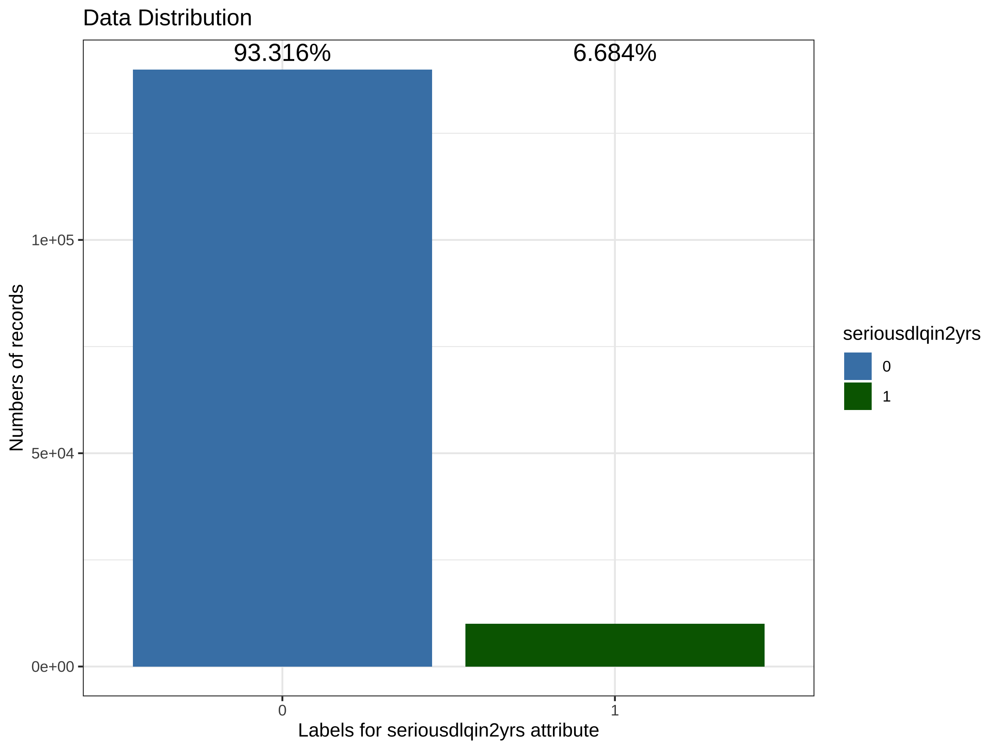
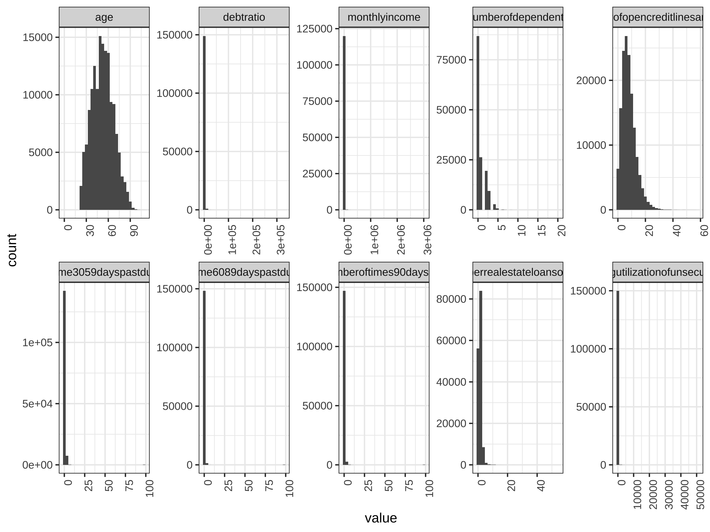
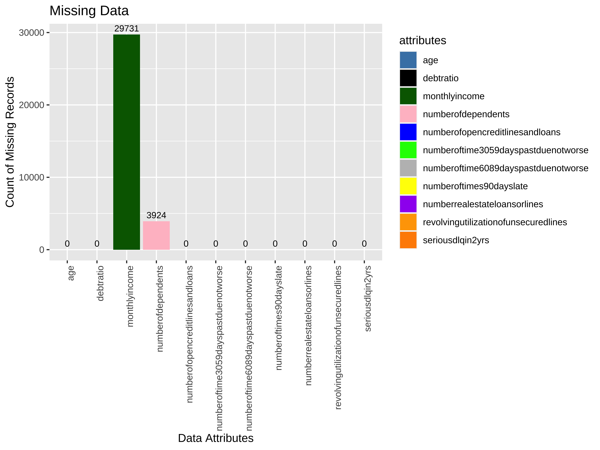
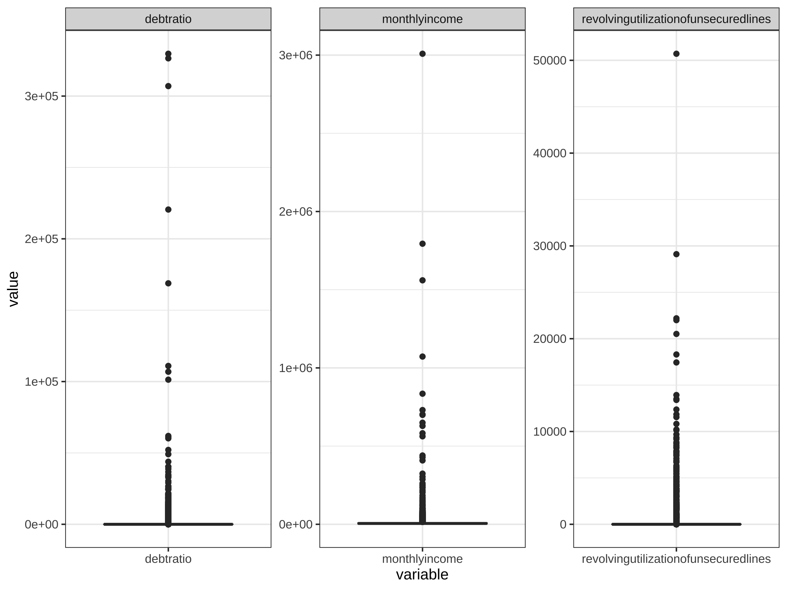
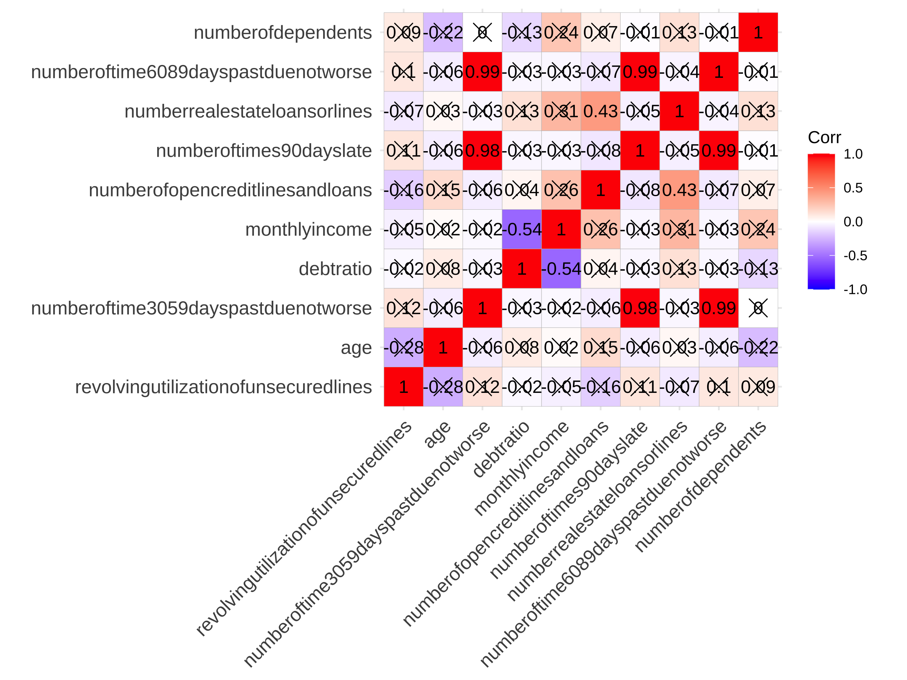
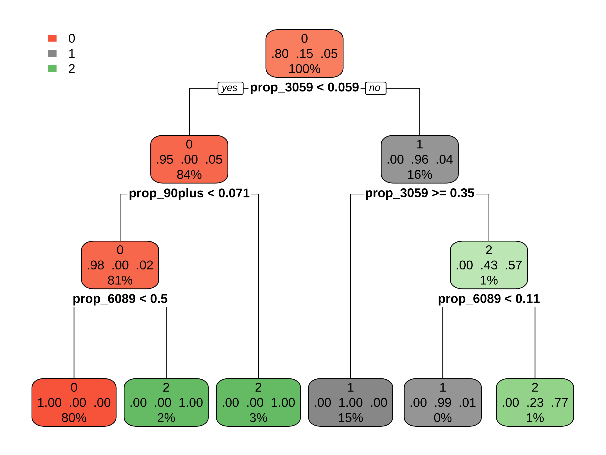

Exploratory Data Analysis (EDA)


```r
setwd("/Users/cailiying/Desktop/cuhk bsc/23:24/23:24 T2/STAT3011/Project2")
library(dlookr)
library(tidyverse)
library(ggcorrplot)
library(patchwork)
```

Data Preprocessing


```r
#Read the CSV file
df <- read_csv("cs-training.csv")
```

```
## New names:
## Rows: 150000 Columns: 12
## ── Column specification
## ────────────────────────────────────────────────────────────────── Delimiter: "," dbl
## (12): ...1, SeriousDlqin2yrs, RevolvingUtilizationOfUnsecuredLines, age, NumberOfT...
## ℹ Use `spec()` to retrieve the full column specification for this data. ℹ Specify the
## column types or set `show_col_types = FALSE` to quiet this message.
## • `` -> `...1`
```

```r
glimpse(df)
```

```
## Rows: 150,000
## Columns: 12
## $ ...1                                   <dbl> 1, 2, 3, 4, 5, 6, 7, 8, 9, 10, 11, 12, 13…
## $ SeriousDlqin2yrs                       <dbl> 1, 0, 0, 0, 0, 0, 0, 0, 0, 0, 0, 0, 0, 1,…
## $ RevolvingUtilizationOfUnsecuredLines   <dbl> 0.76612661, 0.95715102, 0.65818014, 0.233…
## $ age                                    <dbl> 45, 40, 38, 30, 49, 74, 57, 39, 27, 57, 3…
## $ `NumberOfTime30-59DaysPastDueNotWorse` <dbl> 2, 0, 1, 0, 1, 0, 0, 0, 0, 0, 0, 0, 0, 3,…
## $ DebtRatio                              <dbl> 8.029821e-01, 1.218762e-01, 8.511338e-02,…
## $ MonthlyIncome                          <dbl> 9120, 2600, 3042, 3300, 63588, 3500, NA, …
## $ NumberOfOpenCreditLinesAndLoans        <dbl> 13, 4, 2, 5, 7, 3, 8, 8, 2, 9, 5, 7, 13, …
## $ NumberOfTimes90DaysLate                <dbl> 0, 0, 1, 0, 0, 0, 0, 0, 0, 0, 0, 0, 0, 3,…
## $ NumberRealEstateLoansOrLines           <dbl> 6, 0, 0, 0, 1, 1, 3, 0, 0, 4, 0, 2, 2, 1,…
## $ `NumberOfTime60-89DaysPastDueNotWorse` <dbl> 0, 0, 0, 0, 0, 0, 0, 0, 0, 0, 0, 0, 0, 1,…
## $ NumberOfDependents                     <dbl> 2, 1, 0, 0, 0, 1, 0, 0, NA, 2, 0, 2, 2, 2…
```

```r
#Computes the statistics of all numerical variables 
describe(df)
```

```
## # A tibble: 12 × 26
##    described_variables           n    na    mean      sd se_mean     IQR skewness kurtosis
##    <chr>                     <int> <int>   <dbl>   <dbl>   <dbl>   <dbl>    <dbl>    <dbl>
##  1 ...1                     150000     0 7.50e+4 4.33e+4 1.12e+2 7.50e+4 6.02e-17 -1.20e+0
##  2 SeriousDlqin2yrs         150000     0 6.68e-2 2.50e-1 6.45e-4 0       3.47e+ 0  1.00e+1
##  3 RevolvingUtilizationOfU… 150000     0 6.05e+0 2.50e+2 6.45e-1 5.29e-1 9.76e+ 1  1.45e+4
##  4 age                      150000     0 5.23e+1 1.48e+1 3.81e-2 2.2 e+1 1.89e- 1 -4.95e-1
##  5 NumberOfTime30-59DaysPa… 150000     0 4.21e-1 4.19e+0 1.08e-2 0       2.26e+ 1  5.22e+2
##  6 DebtRatio                150000     0 3.53e+2 2.04e+3 5.26e+0 6.93e-1 9.52e+ 1  1.37e+4
##  7 MonthlyIncome            120269 29731 6.67e+3 1.44e+4 4.15e+1 4.85e+3 1.14e+ 2  1.95e+4
##  8 NumberOfOpenCreditLines… 150000     0 8.45e+0 5.15e+0 1.33e-2 6   e+0 1.22e+ 0  3.09e+0
##  9 NumberOfTimes90DaysLate  150000     0 2.66e-1 4.17e+0 1.08e-2 0       2.31e+ 1  5.38e+2
## 10 NumberRealEstateLoansOr… 150000     0 1.02e+0 1.13e+0 2.92e-3 2   e+0 3.48e+ 0  6.05e+1
## 11 NumberOfTime60-89DaysPa… 150000     0 2.40e-1 4.16e+0 1.07e-2 0       2.33e+ 1  5.46e+2
## 12 NumberOfDependents       146076  3924 7.57e-1 1.12e+0 2.92e-3 1   e+0 1.59e+ 0  3.00e+0
## # ℹ 17 more variables: p00 <dbl>, p01 <dbl>, p05 <dbl>, p10 <dbl>, p20 <dbl>, p25 <dbl>,
## #   p30 <dbl>, p40 <dbl>, p50 <dbl>, p60 <dbl>, p70 <dbl>, p75 <dbl>, p80 <dbl>,
## #   p90 <dbl>, p95 <dbl>, p99 <dbl>, p100 <dbl>
```

```r
#Drop the column (Unnamed: 0)
df <- df[,-1]

#Clean the column names
colnames(df) <- gsub("-", "", tolower(colnames(df)))

head(df)
```

```
## # A tibble: 6 × 11
##   seriousdlqin2yrs revolvingutilizationofunsecure…¹   age numberoftime3059days…² debtratio
##              <dbl>                            <dbl> <dbl>                  <dbl>     <dbl>
## 1                1                            0.766    45                      2    0.803 
## 2                0                            0.957    40                      0    0.122 
## 3                0                            0.658    38                      1    0.0851
## 4                0                            0.234    30                      0    0.0360
## 5                0                            0.907    49                      1    0.0249
## 6                0                            0.213    74                      0    0.376 
## # ℹ abbreviated names: ¹​revolvingutilizationofunsecuredlines,
## #   ²​numberoftime3059dayspastduenotworse
## # ℹ 6 more variables: monthlyincome <dbl>, numberofopencreditlinesandloans <dbl>,
## #   numberoftimes90dayslate <dbl>, numberrealestateloansorlines <dbl>,
## #   numberoftime6089dayspastduenotworse <dbl>, numberofdependents <dbl>
```

```r
#Compute descriptive statistics
df_subset <- df[, 2:ncol(df)]
properties <- summary(df_subset)
(std_dev <- apply(df_subset, 2, sd))
```

```
## revolvingutilizationofunsecuredlines                                  age 
##                           249.755371                            14.771866 
##  numberoftime3059dayspastduenotworse                            debtratio 
##                             4.192781                          2037.818523 
##                        monthlyincome      numberofopencreditlinesandloans 
##                                   NA                             5.145951 
##              numberoftimes90dayslate         numberrealestateloansorlines 
##                             4.169304                             1.129771 
##  numberoftime6089dayspastduenotworse                   numberofdependents 
##                             4.155179                                   NA
```

```r
(non_missing_counts <- colSums(!is.na(df_subset)))
```

```
## revolvingutilizationofunsecuredlines                                  age 
##                               150000                               150000 
##  numberoftime3059dayspastduenotworse                            debtratio 
##                               150000                               150000 
##                        monthlyincome      numberofopencreditlinesandloans 
##                               120269                               150000 
##              numberoftimes90dayslate         numberrealestateloansorlines 
##                               150000                               150000 
##  numberoftime6089dayspastduenotworse                   numberofdependents 
##                               150000                               146076
```

```r
(means<-properties[4,])
```

```
## revolvingutilizationofunsecuredlines                                  age 
##                 "Mean   :    6.05  "                    "Mean   : 52.3  " 
##  numberoftime3059dayspastduenotworse                            debtratio 
##                   "Mean   : 0.421  "                 "Mean   :   353.0  " 
##                        monthlyincome      numberofopencreditlinesandloans 
##                  "Mean   :   6670  "                   "Mean   : 8.453  " 
##              numberoftimes90dayslate         numberrealestateloansorlines 
##                   "Mean   : 0.266  "                   "Mean   : 1.018  " 
##  numberoftime6089dayspastduenotworse                   numberofdependents 
##                  "Mean   : 0.2404  "                   "Mean   : 0.757  "
```

```r
(medians<-properties[3,])
```

```
## revolvingutilizationofunsecuredlines                                  age 
##                 "Median :    0.15  "                    "Median : 52.0  " 
##  numberoftime3059dayspastduenotworse                            debtratio 
##                   "Median : 0.000  "                 "Median :     0.4  " 
##                        monthlyincome      numberofopencreditlinesandloans 
##                  "Median :   5400  "                   "Median : 8.000  " 
##              numberoftimes90dayslate         numberrealestateloansorlines 
##                   "Median : 0.000  "                   "Median : 1.000  " 
##  numberoftime6089dayspastduenotworse                   numberofdependents 
##                  "Median : 0.0000  "                   "Median : 0.000  "
```

```r
#Calculate the total length of the training data
total_len <- length(df$seriousdlqin2yrs)

#Calculate the percentage of each category in the target label
percentage_labels <- prop.table(table(df$seriousdlqin2yrs)) * 100

#Print the percentage labels
print(percentage_labels)
```

```
## 
##      0      1 
## 93.316  6.684
```

```r
library(ggplot2)
df$seriousdlqin2yrs <- as.factor(df$seriousdlqin2yrs)

#Define custom colors for each bar
bar_colors <- c("steelblue", "darkgreen")

#Create the countplot with different colors for each bar
plot <- ggplot(df, aes(x = seriousdlqin2yrs, fill = seriousdlqin2yrs)) +
  geom_bar() +
  scale_fill_manual(values = bar_colors) +
  labs(title = "Data Distribution",
       x = "Labels for seriousdlqin2yrs attribute",
       y = "Numbers of records") +
  theme_bw()

#Create a data frame with label values for each bar
label_data <- data.frame(
  seriousdlqin2yrs = levels(df$seriousdlqin2yrs),
  #Specify the label values for each bar as percentages
  label = c(93.316, 6.684) / 100  
)

#Compute the maximum bar height
max_height <- max(table(df$seriousdlqin2yrs))

#Add labels to the plot
plot_with_labels <- plot +
  geom_text(data = label_data,
            aes(label = paste0(label * 100, "%"), fill = seriousdlqin2yrs),
            y = max_height, vjust = -0.5, size = 5, position = position_stack(vjust = 0.5))
```

```
## Warning in geom_text(data = label_data, aes(label = paste0(label * 100, : Ignoring
## unknown aesthetics: fill
```

```r
#Display the plot
print(plot_with_labels)
```

```
## Warning: Stacking requires either the ymin and ymin or the y aesthetics
## ℹ Maybe you want `position = "identity"`?
```


Plot every variables


```r
df_numeric <- df %>% 
  ##select all numeric column
  select(where(is.numeric))

df_numeric %>% 
  pivot_longer(everything(),names_to = "variable",values_to = "value") %>% 
  ggplot(aes(x=value))+
  geom_histogram()+
  facet_wrap(~variable,scales = "free")+
  theme_bw()
```

```
## `stat_bin()` using `bins = 30`. Pick better value with `binwidth`.
```

```
## Warning: Removed 33655 rows containing non-finite values (`stat_bin()`).
```



```r
#Many variables are very unevenly distributed
```

MISSING VALUES 


```r
#Calculate the count of missing values in each attribute
missing_counts <- colSums(is.na(df))

#Create a data frame with x and y values
missing_data <- data.frame(attributes = names(missing_counts),
                           missing_count = missing_counts)

#Create the bar plot
bar_colors <- c("steelblue","black","darkgreen", "pink","blue","green","grey","yellow","purple","orange","darkorange")
plot <- ggplot(missing_data, aes(x = attributes, y = missing_count, fill = attributes)) +
  geom_bar(stat = "identity") +
  scale_fill_manual(values = bar_colors) +
  labs(title = "Missing Data",
       x = "Data Attributes",
       y = "Count of Missing Records") +
  #Rotate x-axis labels if needed
  theme(axis.text.x = element_text(angle = 90, hjust = 1))  

#Add labels to the plot
plot_with_labels <- plot +
  geom_text(aes(label = missing_count), vjust = -0.5, size = 3)

#Display the plot
print(plot_with_labels)
```



```r
#There are two variables "monthly income" and "number of dependents" with missing values.

#Fill in the missing values of these two variables and calculate their average values according to age groups.
table(df$age)
```

```
## 
##    0   21   22   23   24   25   26   27   28   29   30   31   32   33   34   35   36   37 
##    1  183  434  641  816  953 1193 1338 1560 1702 1937 2038 2050 2239 2155 2246 2379 2521 
##   38   39   40   41   42   43   44   45   46   47   48   49   50   51   52   53   54   55 
## 2631 2987 3093 3122 3082 3208 3294 3502 3714 3719 3806 3837 3753 3627 3609 3648 3561 3416 
##   56   57   58   59   60   61   62   63   64   65   66   67   68   69   70   71   72   73 
## 3589 3375 3443 3280 3258 3522 3568 3719 3058 2594 2494 2503 2235 1954 1777 1646 1649 1520 
##   74   75   76   77   78   79   80   81   82   83   84   85   86   87   88   89   90   91 
## 1451 1241 1183 1099 1054  981  876  774  647  512  480  483  407  357  313  276  198  154 
##   92   93   94   95   96   97   98   99  101  102  103  105  107  109 
##   93   87   47   45   18   17    6    9    3    3    3    1    1    2
```

```r
#delete age=0, change age=21 to 22
df <- df[df$age != 0, ]
df$age[df$age == 21] <- 22
table(df$age)
```

```
## 
##   22   23   24   25   26   27   28   29   30   31   32   33   34   35   36   37   38   39 
##  617  641  816  953 1193 1338 1560 1702 1937 2038 2050 2239 2155 2246 2379 2521 2631 2987 
##   40   41   42   43   44   45   46   47   48   49   50   51   52   53   54   55   56   57 
## 3093 3122 3082 3208 3294 3502 3714 3719 3806 3837 3753 3627 3609 3648 3561 3416 3589 3375 
##   58   59   60   61   62   63   64   65   66   67   68   69   70   71   72   73   74   75 
## 3443 3280 3258 3522 3568 3719 3058 2594 2494 2503 2235 1954 1777 1646 1649 1520 1451 1241 
##   76   77   78   79   80   81   82   83   84   85   86   87   88   89   90   91   92   93 
## 1183 1099 1054  981  876  774  647  512  480  483  407  357  313  276  198  154   93   87 
##   94   95   96   97   98   99  101  102  103  105  107  109 
##   47   45   18   17    6    9    3    3    3    1    1    2
```

```r
#categorize age into five age_group: 20-30, 31-40, 41-50, 51-60, 60+
df$age_group<-cut(df$age, breaks = c(20, 30, 40, 50, 60, Inf), 
                  labels = c("20-30", "31-40", "41-50", "51-60", "60+"),
                  right = FALSE)
table(df$age_group)
```

```
## 
## 20-30 31-40 41-50 51-60   60+ 
##  8820 23183 34377 35301 48318
```

```r
df <- subset(df, select = -age)
#Calculate the average monthly income and number of dependents for each age group
df_summary <- df %>%
  group_by(age_group) %>%
  summarise(
    avg_monthly_income = mean(monthlyincome, na.rm = TRUE),
    avg_number_of_dependents = round(mean(numberofdependents, na.rm = TRUE))
  )
print(df_summary)
```

```
## # A tibble: 5 × 3
##   age_group avg_monthly_income avg_number_of_dependents
##   <fct>                  <dbl>                    <dbl>
## 1 20-30                  2989.                        0
## 2 31-40                  5520.                        1
## 3 41-50                  7220.                        1
## 4 51-60                  7777.                        1
## 5 60+                    6747.                        0
```

```r
#Merge the average values back into the original data frame
df <- df %>%
  left_join(df_summary, by = "age_group") %>%
  mutate(
    numberofdependents = ifelse(is.na(numberofdependents), avg_number_of_dependents, 
                                numberofdependents),
    monthlyincome = ifelse(is.na(monthlyincome), avg_monthly_income, monthlyincome)
  ) %>%
  #Remove the temporary average columns
  select(-avg_number_of_dependents, -avg_monthly_income) 

#Check Missing value again
colSums(is.na(df))
```

```
##                     seriousdlqin2yrs revolvingutilizationofunsecuredlines 
##                                    0                                    0 
##  numberoftime3059dayspastduenotworse                            debtratio 
##                                    0                                    0 
##                        monthlyincome      numberofopencreditlinesandloans 
##                                    0                                    0 
##              numberoftimes90dayslate         numberrealestateloansorlines 
##                                    0                                    0 
##  numberoftime6089dayspastduenotworse                   numberofdependents 
##                                    0                                    0 
##                            age_group 
##                                    0
```

CORRELATION


```r
df_numeric <- df %>% 
  ##select all numeric column
  select(where(is.numeric))
cor <- cor(df_numeric,method = "spearman")
p_mat <- ggcorrplot::cor_pmat(cor)
ggcorrplot::ggcorrplot(cor,p.mat = p_mat,lab = TRUE)
```



OUTLIER DETECTION


```r
#Boxplot
df %>% select(
  debtratio, numberofopencreditlinesandloans, numberrealestateloansorlines,  
  numberofdependents, revolvingutilizationofunsecuredlines, numberoftime3059dayspastduenotworse,
  monthlyincome, numberoftimes90dayslate, numberoftime6089dayspastduenotworse
) %>%
  pivot_longer(everything(), names_to = "variable", values_to = "value") %>%
  ggplot(aes(x=variable, y=value)) +
  geom_boxplot() +
  facet_wrap(~variable, scales = "free") +
  theme_bw()
```



```r
#Since the data contains a large number of outliers and is unevenly distributed, 
#it is better to use the MAD method to remove outliers.
percentile_based_outlier <- function(data, threshold = 95) {
  diff <- (100 - threshold) / 2.0
  minval <- quantile(data, diff / 100)
  maxval <- quantile(data, 1 - diff / 100)
  return((data < minval) | (data > maxval))
}
mad_outlier_location <- function(points, thresh = 3.5) {
  median_y <- median(points, na.rm = TRUE)
  mad <- median(abs(points - median_y), na.rm = TRUE)
  modified_z_scores <- 0.6745 * (points - median_y) / mad
  return(abs(modified_z_scores) > thresh)
}

#Remove some outliers using MAD method
debtratio_outlier <- mad_outlier_location(df$debtratio)
df <- df[!debtratio_outlier, ]

monthlyincome_outlier <- mad_outlier_location(matrix(df$monthlyincome, ncol = 1))
df <- df[!monthlyincome_outlier, ]

revolvingutilizationofunsecuredlines_outlier <- mad_outlier_location(matrix(df$revolvingutilizationofunsecuredlines, ncol = 1))
df <- df[!revolvingutilizationofunsecuredlines_outlier, ]

#Check boxplot again
df %>% select(
  debtratio, numberofopencreditlinesandloans, numberrealestateloansorlines,  
  numberofdependents, revolvingutilizationofunsecuredlines, numberoftime3059dayspastduenotworse,
  monthlyincome, numberoftimes90dayslate, numberoftime6089dayspastduenotworse
) %>%
  pivot_longer(everything(), names_to = "variable", values_to = "value") %>%
  ggplot(aes(x=variable, y=value)) +
  geom_boxplot() +
  facet_wrap(~variable, scales = "free") +
  theme_bw()
```


Plot every variables


```r
df_numeric <- df %>% 
  ##select all numeric column
  select(where(is.numeric))

df_numeric %>% 
  pivot_longer(everything(),names_to = "variable",values_to = "value") %>% 
  ggplot(aes(x=value))+
  geom_histogram()+
  facet_wrap(~variable,scales = "free")+
  theme_bw()
```

```
## `stat_bin()` using `bins = 30`. Pick better value with `binwidth`.
```


Process the three variables 'numberoftime3059dayspastduenotworse', 'numberoftime6089dayspastduenotworse', 'numberoftimes90dayslate'


```r
#Create a new column 'category_pastdue' to store the classification
df$category_pastdue <- apply(df[, c('numberoftime3059dayspastduenotworse', 
                                    'numberoftime6089dayspastduenotworse', 
                                    'numberoftimes90dayslate')], 1, function(x) {
  #Calculate the total number of past due occurrences
  total_past_due <- x['numberoftime3059dayspastduenotworse'] + 
    x['numberoftime6089dayspastduenotworse'] + x['numberoftimes90dayslate']
  #Calculate the proportion for each time frame
  prop_3059 <- ifelse(is.na(x['numberoftime3059dayspastduenotworse'] / total_past_due), 0, 
                      x['numberoftime3059dayspastduenotworse'] / total_past_due)
  prop_6089 <- ifelse(is.na(x['numberoftime6089dayspastduenotworse'] / total_past_due), 0, 
                      x['numberoftime6089dayspastduenotworse'] / total_past_due)
  prop_90plus <- ifelse(is.na(x['numberoftimes90dayslate'] / total_past_due), 0, 
                        x['numberoftimes90dayslate'] / total_past_due)
  if (prop_3059 == 0 & 
      prop_6089 == 0 & 
      prop_90plus == 0) {
    return('No Past Due')
  } else {
    #Classify based on the proportions
    if (prop_3059 > 0.5) {
      return('Mostly 30-59 Days Past Due')
    } else if (prop_6089 > 0.3) {
      return('Mostly 60-89 Days Past Due')
    } else {
      return('Mostly 90 days/+ Past Due')
    }
  }
})
table(df$category_pastdue)
```

```
## 
## Mostly 30-59 Days Past Due Mostly 60-89 Days Past Due  Mostly 90 days/+ Past Due 
##                      15040                       4072                       4128 
##                No Past Due 
##                      90076
```

```r
#remove three columns
df <- subset(df, select = -c(numberoftime3059dayspastduenotworse, numberoftime6089dayspastduenotworse, numberoftimes90dayslate))
```

Process "numberofdependents"


```r
df$categoryofdependents <- cut(df$numberofdependents,
                               breaks = c(-Inf, 0, 1, 2, Inf),
                               labels = c("0", "1", "2", "3+"),
                               right = FALSE)
df <- subset(df, select = -numberofdependents)
```

continue to process other variables


```r
#......
```

Plot Categoriacal variables


```r
df_chr <- df %>% 
  select(where(is.character))
df_chr %>% 
  pivot_longer(everything(),names_to = "variable",values_to = "value") %>% 
  ggplot(aes(x=value))+
  geom_bar()+
  facet_wrap(~variable,scales = "free")+
  theme_bw()
```



See correlation again


```r
df_numeric <- df %>% 
  ##select all numeric column
  select(where(is.numeric))
cor <- cor(df_numeric,method = "spearman")
p_mat <- ggcorrplot::cor_pmat(cor)
ggcorrplot::ggcorrplot(cor,p.mat = p_mat,lab = TRUE)
```



Now we start to see the relation between response and predictors.


```r
#........
```

