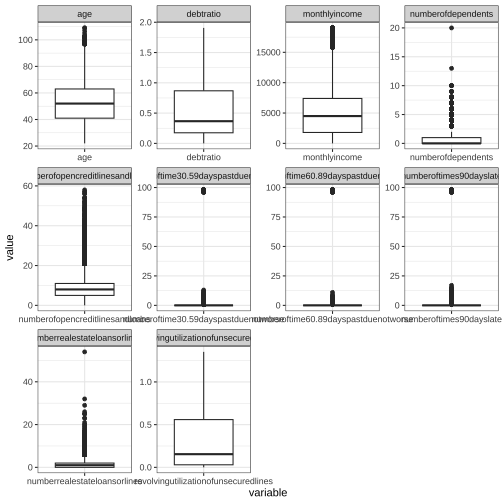
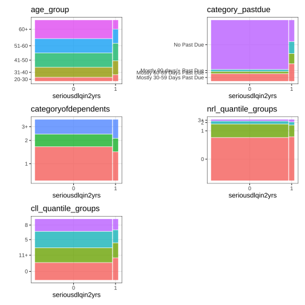
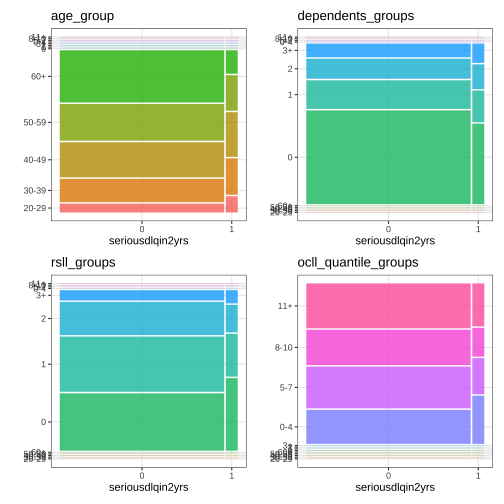

# Exploratory Data Analysis (EDA)


```r
setwd("/Users/cailiying/Desktop/cuhk bsc/23:24/23:24 T2/STAT3011/Project2")
install.packages("readr")
```

```
## Installing package into '/Users/cailiying/Library/R/arm64/4.3/library'
## (as 'lib' is unspecified)
```

```
## 
## The downloaded binary packages are in
## 	/var/folders/bt/n20rw5js7_j8_ld683d7_l180000gn/T//RtmpRI1EC4/downloaded_packages
```

```r
library(readr)
library(rpart)
library(rpart.plot)
df = read.csv("cs-training.csv", header= TRUE)
install.packages("timechange", repos = "https://cran.rstudio.com/")
```

```
## Installing package into '/Users/cailiying/Library/R/arm64/4.3/library'
## (as 'lib' is unspecified)
```

```
## 
## The downloaded binary packages are in
## 	/var/folders/bt/n20rw5js7_j8_ld683d7_l180000gn/T//RtmpRI1EC4/downloaded_packages
```

```r
install.packages("recipes", repos = "https://cran.rstudio.com/")
```

```
## Installing package into '/Users/cailiying/Library/R/arm64/4.3/library'
## (as 'lib' is unspecified)
```

```
## 
## The downloaded binary packages are in
## 	/var/folders/bt/n20rw5js7_j8_ld683d7_l180000gn/T//RtmpRI1EC4/downloaded_packages
```

```r
install.packages("rlang", repos = "https://cran.rstudio.com/")
```

```
## Error in install.packages : Updating loaded packages
```

```r
install.packages("dlookr", repos = "https://cran.rstudio.com/")
```

```
## Installing package into '/Users/cailiying/Library/R/arm64/4.3/library'
## (as 'lib' is unspecified)
```

```
## 
## The downloaded binary packages are in
## 	/var/folders/bt/n20rw5js7_j8_ld683d7_l180000gn/T//RtmpRI1EC4/downloaded_packages
```

```r
library(dlookr)
```

```
## 
## Attaching package: 'dlookr'
```

```
## The following object is masked from 'package:base':
## 
##     transform
```

```r
library(tidyverse)
```

```
## ── Attaching core tidyverse packages ────────────────────────────────────────────────── tidyverse 2.0.0 ──
## ✔ dplyr     1.1.3     ✔ purrr     1.0.2
## ✔ forcats   1.0.0     ✔ stringr   1.5.0
## ✔ ggplot2   3.4.3     ✔ tibble    3.2.1
## ✔ lubridate 1.9.3     ✔ tidyr     1.3.0
```

```
## ── Conflicts ──────────────────────────────────────────────────────────────────── tidyverse_conflicts() ──
## ✖ tidyr::extract() masks dlookr::extract()
## ✖ dplyr::filter()  masks stats::filter()
## ✖ dplyr::lag()     masks stats::lag()
## ℹ Use the conflicted package (<http://conflicted.r-lib.org/>) to force all conflicts to become errors
```

```r
library(conflicted)
conflicts_prefer("tidyr", "extract")
```

```
## Error in `conflicts_prefer()`:
## ! All arguments must be in form `pkg::fun` or `pkg::fun()`.
```

```r
conflicts_prefer("dplyr", c("filter", "lag"))
```

```
## Error in `conflicts_prefer()`:
## ! All arguments must be in form `pkg::fun` or `pkg::fun()`.
```

```r
library(ggcorrplot)
library(patchwork)
```

# Descriptive Statistics


```r
#Computes the statistics of all numerical variables 
#describe(df)
#In SQL
library(RSQL) #Generate and Process 'SQL' Queries in R
library(RSQLite)
con <- dbConnect(drv = RSQLite::SQLite(),
                 dbname = ":memory:")
dbListTables(con)
```

```
## character(0)
```

```r
training_data = read.csv("cs-training.csv")
#Drop the column (Unnamed: 0)
training_data <- training_data[,-1]

#Clean the column names
colnames(training_data) <- gsub("[-,.]", "", tolower(colnames(training_data)))
head(training_data)
```

```
##   seriousdlqin2yrs revolvingutilizationofunsecuredlines age numberoftime3059dayspastduenotworse
## 1                1                            0.7661266  45                                   2
## 2                0                            0.9571510  40                                   0
## 3                0                            0.6581801  38                                   1
## 4                0                            0.2338098  30                                   0
## 5                0                            0.9072394  49                                   1
## 6                0                            0.2131787  74                                   0
##    debtratio monthlyincome numberofopencreditlinesandloans numberoftimes90dayslate
## 1 0.80298213          9120                              13                       0
## 2 0.12187620          2600                               4                       0
## 3 0.08511338          3042                               2                       1
## 4 0.03604968          3300                               5                       0
## 5 0.02492570         63588                               7                       0
## 6 0.37560697          3500                               3                       0
##   numberrealestateloansorlines numberoftime6089dayspastduenotworse numberofdependents
## 1                            6                                   0                  2
## 2                            0                                   0                  1
## 3                            0                                   0                  0
## 4                            0                                   0                  0
## 5                            1                                   0                  0
## 6                            1                                   0                  1
```

```r
#Load the table
dbWriteTable(conn = con, 
             name = "training_data",
             value = training_data)
describe  =  DBI::dbGetQuery(conn = con,
                             statement = "
                SELECT 'revolvingutilizationofunsecuredlines' AS variable,
                       COUNT(revolvingutilizationofunsecuredlines) AS count,
                       AVG(revolvingutilizationofunsecuredlines) AS mean,
                       STDEV(revolvingutilizationofunsecuredlines) AS std,
                       MIN(revolvingutilizationofunsecuredlines) AS min,
                       MAX(revolvingutilizationofunsecuredlines) AS max
                FROM training_data
                UNION ALL
                SELECT 'age' AS variable,
                       COUNT(age) AS count,
                       AVG(age) AS mean,
                       STDEV(age) AS std,
                       MIN(age) AS min,
                       MAX(age) AS max
                FROM training_data
                UNION ALL
                SELECT 'numberoftime3059dayspastduenotworse' AS variable,
                       COUNT(numberoftime3059dayspastduenotworse) AS count,
                       AVG(numberoftime3059dayspastduenotworse) AS mean,
                       STDEV(numberoftime3059dayspastduenotworse) AS std,
                       MIN(numberoftime3059dayspastduenotworse) AS min,
                       MAX(numberoftime3059dayspastduenotworse) AS max
                FROM training_data
                UNION ALL
                SELECT 'debtratio' AS variable,
                       COUNT(debtratio) AS count,
                       AVG(debtratio) AS mean,
                       STDEV(debtratio) AS std,
                       MIN(debtratio) AS min,
                       MAX(debtratio) AS max
                FROM training_data
                UNION ALL
                SELECT 'monthlyincome' AS variable,
                       COUNT(monthlyincome) AS count,
                       AVG(monthlyincome) AS mean,
                       STDEV(monthlyincome) AS std,
                       MIN(monthlyincome) AS min,
                       MAX(monthlyincome) AS max
                FROM training_data
                UNION ALL
                SELECT 'numberofopencreditlinesandloans' AS variable,
                       COUNT(numberofopencreditlinesandloans) AS count,
                       AVG(numberofopencreditlinesandloans) AS mean,
                       STDEV(numberofopencreditlinesandloans) AS std,
                       MIN(numberofopencreditlinesandloans) AS min,
                       MAX(numberofopencreditlinesandloans) AS max
                FROM training_data
                UNION ALL 
                SELECT 'numberoftimes90dayslate' AS variable,
                       COUNT(numberoftimes90dayslate) AS count,
                       AVG(numberoftimes90dayslate) AS mean,
                       STDEV(numberoftimes90dayslate) AS std,
                       MIN(numberoftimes90dayslate) AS min,
                       MAX(numberoftimes90dayslate) AS max
                FROM training_data
                UNION ALL
                SELECT 'numberrealestateloansorlines' AS variable,
                       COUNT(numberrealestateloansorlines) AS count,
                       AVG(numberrealestateloansorlines) AS mean,
                       STDEV(numberrealestateloansorlines) AS std,
                       MIN(numberrealestateloansorlines) AS min,
                       MAX(numberrealestateloansorlines) AS max
                FROM training_data
                UNION ALL
                SELECT 'numberoftime6089dayspastduenotworse' AS variable,
                       COUNT(numberoftime6089dayspastduenotworse) AS count,
                       AVG(numberoftime6089dayspastduenotworse) AS mean,
                       STDEV(numberoftime6089dayspastduenotworse) AS std,
                       MIN(numberoftime6089dayspastduenotworse) AS min,
                       MAX(numberoftime6089dayspastduenotworse) AS max
                FROM training_data
                UNION ALL
                SELECT 'numberofdependents' AS variable,
                       COUNT(numberofdependents) AS count,
                       AVG(numberofdependents) AS mean,
                       STDEV(numberofdependents) AS std,
                       MIN(numberofdependents) AS min,
                       MAX(numberofdependents) AS max
                FROM training_data
                ")
describe=as.matrix(describe)
#calculate percentiles
percentiles <- apply(training_data, 2, quantile, probs = c(0.25, 0.50, 0.75), na.rm = TRUE)
percentiles = percentiles[,2:11]
a=t(percentiles)
describe=cbind(a,describe)
#descriptive analysis
describe
```

```
##                                      25%             50%           75%            
## revolvingutilizationofunsecuredlines "0.029867442"   "0.154180737" "0.5590462475" 
## age                                  "41"            "52"          "63"           
## numberoftime3059dayspastduenotworse  "0"             "0"           "0"            
## debtratio                            "0.17507383225" "0.366507841" "0.86825377325"
## monthlyincome                        "3400"          "5400"        "8249"         
## numberofopencreditlinesandloans      "5"             "8"           "11"           
## numberoftimes90dayslate              "0"             "0"           "0"            
## numberrealestateloansorlines         "0"             "1"           "2"            
## numberoftime6089dayspastduenotworse  "0"             "0"           "0"            
## numberofdependents                   "0"             "0"           "1"            
##                                      variable                               count    mean          
## revolvingutilizationofunsecuredlines "revolvingutilizationofunsecuredlines" "150000" "   6.0484381"
## age                                  "age"                                  "150000" "  52.2952067"
## numberoftime3059dayspastduenotworse  "numberoftime3059dayspastduenotworse"  "150000" "   0.4210333"
## debtratio                            "debtratio"                            "150000" " 353.0050758"
## monthlyincome                        "monthlyincome"                        "120269" "6670.2212374"
## numberofopencreditlinesandloans      "numberofopencreditlinesandloans"      "150000" "   8.4527600"
## numberoftimes90dayslate              "numberoftimes90dayslate"              "150000" "   0.2659733"
## numberrealestateloansorlines         "numberrealestateloansorlines"         "150000" "   1.0182400"
## numberoftime6089dayspastduenotworse  "numberoftime6089dayspastduenotworse"  "150000" "   0.2403867"
## numberofdependents                   "numberofdependents"                   "146076" "   0.7572223"
##                                      std            min max      
## revolvingutilizationofunsecuredlines "  249.755371" "0" "  50708"
## age                                  "   14.771866" "0" "    109"
## numberoftime3059dayspastduenotworse  "    4.192781" "0" "     98"
## debtratio                            " 2037.818523" "0" " 329664"
## monthlyincome                        "14384.674215" "0" "3008750"
## numberofopencreditlinesandloans      "    5.145951" "0" "     58"
## numberoftimes90dayslate              "    4.169304" "0" "     98"
## numberrealestateloansorlines         "    1.129771" "0" "     54"
## numberoftime6089dayspastduenotworse  "    4.155179" "0" "     98"
## numberofdependents                   "    1.115086" "0" "     20"
```

```r
#Drop the column (Unnamed: 0)
df <- df[,-1]

#Clean the column names
colnames(df) <- gsub("-", "", tolower(colnames(df)))
```

# Plot the distribution of target variable “seriousdlqin2yrs”


```r
#Calculate the total length of the training data
total_len <- length(df$seriousdlqin2yrs)

#Calculate the percentage of each category in the target label
percentage_labels <- prop.table(table(df$seriousdlqin2yrs)) * 100
#Print the percentage labels
print(percentage_labels)
```

```
## 
##      0      1 
## 93.316  6.684
```

```r
library(ggplot2)
df$seriousdlqin2yrs <- as.factor(df$seriousdlqin2yrs)
#Define custom colors for each bar
bar_colors <- c("steelblue", "darkgreen")
#Create the countplot with different colors for each bar
plot <- ggplot(df, aes(x = seriousdlqin2yrs, fill = seriousdlqin2yrs)) +
  geom_bar() +
  scale_fill_manual(values = bar_colors) +
  labs(title = "Data Distribution",
       x = "Labels for seriousdlqin2yrs attribute",
       y = "Numbers of records") +
  theme_bw()
#Create a data frame with label values for each bar
label_data <- data.frame(
  seriousdlqin2yrs = levels(df$seriousdlqin2yrs),
  #Specify the label values for each bar as percentages
  label = c(93.316, 6.684) / 100  
)
#Compute the maximum bar height
max_height <- max(table(df$seriousdlqin2yrs))
#Add labels to the plot
plot_with_labels <- plot +
  geom_text(data = label_data,
            aes(label = paste0(label * 100, "%"), fill = seriousdlqin2yrs),
            y = max_height, vjust = -0.5, size = 5, position = position_stack(vjust = 0.5))
```

```
## Warning in geom_text(data = label_data, aes(label = paste0(label * 100, : Ignoring unknown aesthetics:
## fill
```

```r
#Display the plot
print(plot_with_labels)
```

```
## Warning: Stacking requires either the ymin and ymin or the y aesthetics
## ℹ Maybe you want `position = "identity"`?
```


Plot every variables


```r
df_numeric <- df %>% 
  ##select all numeric column
  select(where(is.numeric))

df_numeric %>% 
  pivot_longer(everything(),names_to = "variable",values_to = "value") %>% 
  ggplot(aes(x=value))+
  geom_histogram()+
  facet_wrap(~variable,scales = "free")+
  theme_bw()
```

```
## `stat_bin()` using `bins = 30`. Pick better value with `binwidth`.
```

```
## Warning: Removed 33655 rows containing non-finite values (`stat_bin()`).
```


```r
#Many variables are very unevenly distributed
```

# MISSING VALUES 


```r
#Calculate the count of missing values in each attribute
missing_counts <- colSums(is.na(df))

#Create a data frame with x and y values
missing_data <- data.frame(attributes = names(missing_counts),
                           missing_count = missing_counts)

#Create the bar plot
bar_colors <- c("steelblue","black","darkgreen", "pink","blue","green","grey","yellow","purple","orange","darkorange")
plot <- ggplot(missing_data, aes(x = attributes, y = missing_count, fill = attributes)) +
  geom_bar(stat = "identity") +
  scale_fill_manual(values = bar_colors) +
  labs(title = "Missing Data",
       x = "Data Attributes",
       y = "Count of Missing Records") +
  #Rotate x-axis labels if needed
  theme(axis.text.x = element_text(angle = 90, hjust = 1))  

#Add labels to the plot
plot_with_labels <- plot +
  geom_text(aes(label = missing_count), vjust = -0.5, size = 3)
#Display the plot
print(plot_with_labels)
```


```r
#There are two variables "monthly income" and "number of dependents" with missing values.

#Fill in the missing values of numberofdependents and calculate the average values according to age groups.
table(df$age)
```

```
## 
##    0   21   22   23   24   25   26   27   28   29   30   31   32   33   34   35   36   37   38   39   40 
##    1  183  434  641  816  953 1193 1338 1560 1702 1937 2038 2050 2239 2155 2246 2379 2521 2631 2987 3093 
##   41   42   43   44   45   46   47   48   49   50   51   52   53   54   55   56   57   58   59   60   61 
## 3122 3082 3208 3294 3502 3714 3719 3806 3837 3753 3627 3609 3648 3561 3416 3589 3375 3443 3280 3258 3522 
##   62   63   64   65   66   67   68   69   70   71   72   73   74   75   76   77   78   79   80   81   82 
## 3568 3719 3058 2594 2494 2503 2235 1954 1777 1646 1649 1520 1451 1241 1183 1099 1054  981  876  774  647 
##   83   84   85   86   87   88   89   90   91   92   93   94   95   96   97   98   99  101  102  103  105 
##  512  480  483  407  357  313  276  198  154   93   87   47   45   18   17    6    9    3    3    3    1 
##  107  109 
##    1    2
```

```r
#delete age=0, change age=21 to 22
df <- df[df$age != 0, ]
df$age[df$age == 21] <- 22
table(df$age)
```

```
## 
##   22   23   24   25   26   27   28   29   30   31   32   33   34   35   36   37   38   39   40   41   42 
##  617  641  816  953 1193 1338 1560 1702 1937 2038 2050 2239 2155 2246 2379 2521 2631 2987 3093 3122 3082 
##   43   44   45   46   47   48   49   50   51   52   53   54   55   56   57   58   59   60   61   62   63 
## 3208 3294 3502 3714 3719 3806 3837 3753 3627 3609 3648 3561 3416 3589 3375 3443 3280 3258 3522 3568 3719 
##   64   65   66   67   68   69   70   71   72   73   74   75   76   77   78   79   80   81   82   83   84 
## 3058 2594 2494 2503 2235 1954 1777 1646 1649 1520 1451 1241 1183 1099 1054  981  876  774  647  512  480 
##   85   86   87   88   89   90   91   92   93   94   95   96   97   98   99  101  102  103  105  107  109 
##  483  407  357  313  276  198  154   93   87   47   45   18   17    6    9    3    3    3    1    1    2
```

```r
#categorize age into five age_group: 20-29, 30-39, 40-49, 50-59, 60+
df$age_group<-cut(df$age, breaks = c(20, 30, 40, 50, 60, Inf), 
                  labels = c("20-29", "30-39", "40-49", "50-59", "60+"),
                  right = FALSE)
table(df$age_group)
```

```
## 
## 20-29 30-39 40-49 50-59   60+ 
##  8820 23183 34377 35301 48318
```

```r
#Calculate the average number of dependents for each age group
df_dependents <- df %>%
  group_by(age_group) %>%
  summarise(
    avg_number_of_dependents = round(mean(numberofdependents, na.rm = TRUE))
  )
print(df_dependents)
```

```
## # A tibble: 5 × 2
##   age_group avg_number_of_dependents
##   <fct>                        <dbl>
## 1 20-29                            0
## 2 30-39                            1
## 3 40-49                            1
## 4 50-59                            1
## 5 60+                              0
```

```r
#Merge the average values back into the original data frame
df <- df %>%
  left_join(df_dependents, by = "age_group") %>%
  mutate(
    numberofdependents = ifelse(is.na(numberofdependents), avg_number_of_dependents, 
                                numberofdependents),
  ) %>%
  #Remove the temporary average columns
  select(-avg_number_of_dependents) 
sum(is.na(df$numberofdependents))
```

```
## [1] 0
```

# OUTLIER DETECTION


```r
#Boxplot
df_numeric <- df %>% 
  ##select all numeric column
  select(where(is.numeric))
df_numeric %>%
  pivot_longer(everything(), names_to = "variable", values_to = "value") %>%
  ggplot(aes(x=variable, y=value)) +
  geom_boxplot() +
  facet_wrap(~variable, scales = "free") +
  theme_bw()
```

```
## Warning: Removed 29731 rows containing non-finite values (`stat_boxplot()`).
```


```r
#OUTLIER DETECTION
percentile_based_outlier <- function(data) {
  stats <- boxplot.stats(data)
  return(data %in% stats$out)
}

mad_based_outlier <- function(data, thresh = 3.5){
  if (length(dim(data)) == 1) {
    data <- matrix(data, ncol = 1)
  }
  med <- median(data)
  mad <- median(abs(data - med))
  modified_z_scores <- 0.6745*(data-med)/mad
  return(modified_z_scores>thresh)
}

std_div<- function(data, threshold=1.96){
  std=sd(data)
  mean=mean(data)
  z <- abs(data - mean)/std
  return(z>threshold)
}

outlierVote <- function(data, mad_thresh = 3.5, std_div_thresh=1.96) {
  pbo <- percentile_based_outlier(data)
  mbo <- mad_based_outlier(data, mad_thresh)
  sdo <- std_div(data, std_div_thresh)
  combined <- (pbo & mbo) | (pbo & sdo) | (mbo & sdo)
  return(combined)
}

plotOutlier <- function(x) {
  par(mfrow = c(4, 1))  # Set up 4 subplots in a vertical layout
  funcs <- list(percentile_based_outlier, mad_based_outlier, std_div, outlierVote)
  titles <- c('Percentile-based Outliers', 'MAD-based Outliers', 'STD-based Outliers', 'Majority vote based Outliers')
  for (i in 1:length(funcs)) {
    outliers <- x[funcs[[i]](x)]
    plot(density(x), main = titles[i], xlab = '', ylab = '', ylim = c(0, max(density(x)$y) * 1.1))  # Plot density estimate
    rug(x)
    points(outliers, rep(0, length(outliers)), col = 'red')  # Plot outliers as red dots
  }
  par(mfrow = c(1, 1))  # Reset plot layout to default
}

# Debtratio Outlier
debtratio_outlier <- outlierVote(df$debtratio)
sum(debtratio_outlier)
```

```
## [1] 31311
```

```r
summary(df[debtratio_outlier==TRUE,"debtratio"])
```

```
##     Min.  1st Qu.   Median     Mean  3rd Qu.     Max. 
##      1.9    160.0   1179.0   1689.9   2383.0 329664.0
```

```r
summary(df[debtratio_outlier==FALSE,"debtratio"])
```

```
##    Min. 1st Qu.  Median    Mean 3rd Qu.    Max. 
##  0.0000  0.1319  0.2841  0.3349  0.4597  1.9068
```

```r
# Replace the debtratio outlier
# all the debtratio outliers are above normal values, we use the max normal value to replace them
df[debtratio_outlier==TRUE, "debtratio"] <- max(df[debtratio_outlier==FALSE, "debtratio"])
summary(df$debtratio)
```

```
##    Min. 1st Qu.  Median    Mean 3rd Qu.    Max. 
##  0.0000  0.1751  0.3665  0.6630  0.8683  1.9068
```

```r
# Monthly income outlier
# Since there exists missing values in monthlyincome, we fill them first
# There are two filling methods
# For debtratio outlier rows, fill monthlyincome values according to the average monthlyincome value of the high/low debtratio outlier groups
# Calculate the median of debtratio_outlier
median_debtratio_out <- median(df$debtratio[debtratio_outlier])
# High and Low debtratio group
low_debtratio_out <- df$debtratio < median_debtratio_out & debtratio_outlier
high_debtratio_out <- df$debtratio >= median_debtratio_out & debtratio_outlier
# Calculate the mean monthlyincome for high and low debtratio groups
avg_monthlyincome_out_low <- mean(df$monthlyincome[low_debtratio_out], na.rm = TRUE)
avg_monthlyincome_out_high <- mean(df$monthlyincome[high_debtratio_out], na.rm = TRUE)
# Fill in the missing values in the monthly income of the debt ratio outlier row
df$monthlyincome[is.na(df$monthlyincome) & low_debtratio_out] <- avg_monthlyincome_out_low
df$monthlyincome[is.na(df$monthlyincome) & high_debtratio_out] <- avg_monthlyincome_out_high

#For other missing value from monthlyincome, we fill them by the average monthlyincome values according to each age groups.
# calculate the average monthly income for each age group
df_monthlyincome <- df %>%
  group_by(age_group) %>%
  summarise(
    avg_monthly_income = mean(monthlyincome, na.rm = TRUE)
  )
print(df_monthlyincome)
```

```
## # A tibble: 5 × 2
##   age_group avg_monthly_income
##   <fct>                  <dbl>
## 1 20-29                  2696.
## 2 30-39                  4920.
## 3 40-49                  6274.
## 4 50-59                  6487.
## 5 60+                    5241.
```

```r
#Merge the average values back into the original data frame
df <- df %>%
  left_join(df_monthlyincome, by = "age_group") %>%
  mutate(
    monthlyincome = ifelse(is.na(monthlyincome), avg_monthly_income, monthlyincome)
  ) %>%
  #Remove the temporary average columns
  select(-avg_monthly_income) 
sum(is.na(df$monthlyincome))
```

```
## [1] 0
```

```r
# Detect monthly income outlier
monthlyincome_outlier <- outlierVote(df$monthlyincome)
sum(monthlyincome_outlier)
```

```
## [1] 2557
```

```r
summary(df[monthlyincome_outlier==FALSE,"monthlyincome"])
```

```
##    Min. 1st Qu.  Median    Mean 3rd Qu.    Max. 
##       0    1700    4400    5005    7125   19022
```

```r
summary(df[monthlyincome_outlier==TRUE,"monthlyincome"])
```

```
##    Min. 1st Qu.  Median    Mean 3rd Qu.    Max. 
##   19036   20834   25000   38247   34000 3008750
```

```r
# all the monthlyincome outliers are above normal values, we use the max normal value to replace them
df[monthlyincome_outlier==TRUE, "monthlyincome"] <- max(df[monthlyincome_outlier==FALSE, "monthlyincome"])
summary(df$monthlyincome)
```

```
##    Min. 1st Qu.  Median    Mean 3rd Qu.    Max. 
##       0    1800    4500    5244    7400   19022
```

```r
# Detect revolvingutilizationofunsecuredlines outlier
revolvingutilizationofunsecuredlines_outlier <- outlierVote(df$revolvingutilizationofunsecuredlines)
sum(revolvingutilizationofunsecuredlines_outlier)
```

```
## [1] 763
```

```r
summary(df[revolvingutilizationofunsecuredlines_outlier==FALSE,"revolvingutilizationofunsecuredlines"])
```

```
##    Min. 1st Qu.  Median    Mean 3rd Qu.    Max. 
## 0.00000 0.02958 0.15189 0.31699 0.54929 1.35216
```

```r
summary(df[revolvingutilizationofunsecuredlines_outlier==TRUE,"revolvingutilizationofunsecuredlines"])
```

```
##     Min.  1st Qu.   Median     Mean  3rd Qu.     Max. 
##     1.35     1.54     1.97  1127.08   753.50 50708.00
```

```r
# all the revolvingutilizationofunsecuredlines outliers are above normal values, we use the max normal value to replace them
df[revolvingutilizationofunsecuredlines_outlier==TRUE, "revolvingutilizationofunsecuredlines"] <- max(df[revolvingutilizationofunsecuredlines_outlier==FALSE, "revolvingutilizationofunsecuredlines"])
summary(df$revolvingutilizationofunsecuredlines)
```

```
##    Min. 1st Qu.  Median    Mean 3rd Qu.    Max. 
## 0.00000 0.02987 0.15418 0.32225 0.55904 1.35216
```

```r
# Plot outliers
sample_data <- df$revolvingutilizationofunsecuredlines[sample(nrow(df), 5000)]
plotOutlier(sample_data)
```


```r
sample_data <- df$debtratio[sample(nrow(df), 5000)]
plotOutlier(sample_data)
```


```r
sample_data <- df$monthlyincome[sample(nrow(df), 5000)]
plotOutlier(sample_data)
```


# CORRELATION


```r
df_numeric <- df %>% 
  ##select all numeric column
  select(where(is.numeric))
cor <- cor(df_numeric)
p_mat <- ggcorrplot::cor_pmat(cor)
ggcorrplot::ggcorrplot(cor,p.mat = p_mat,lab = TRUE)
```


decision tree


```r
#Calculate the total number of past due occurrences and proportion of each of tree pastduedate variables
total_past_due <- df$numberoftime3059dayspastduenotworse + df$numberoftime6089dayspastduenotworse + df$numberoftimes90dayslate
df$prop3059 <- ifelse(is.na(df$numberoftime3059dayspastduenotworse/total_past_due),0,df$numberoftime3059dayspastduenotworse / total_past_due)
```

```
## Error in `$<-.data.frame`(`*tmp*`, prop3059, value = logical(0)): replacement has 0 rows, data has 149999
```

```r
df$prop6089 <- ifelse(is.na(df$numberoftime6089dayspastduenotworse / total_past_due), 0, df$numberoftime6089dayspastduenotworse/total_past_due)
```

```
## Error in `$<-.data.frame`(`*tmp*`, prop6089, value = logical(0)): replacement has 0 rows, data has 149999
```

```r
df$prop90 <- ifelse(is.na(df$numberoftimes90dayslate / total_past_due), 0, df$numberoftimes90dayslate/total_past_due)
```

```
## Error in `$<-.data.frame`(`*tmp*`, prop90, value = logical(0)): replacement has 0 rows, data has 149999
```

```r
library(lattice)
library(caret)
# Set the seed for reproducibility
set.seed(123)
# Proportion of data to be allocated for testing (i.e.,80% training, 20% testing)
test_prop <- 0.2
# Create an index vector for splitting
train_index <- createDataPartition(df$seriousdlqin2yrs, p = test_prop, list = FALSE)
# Split the data into training and testing sets
train_df <- df[train_index, ]
test_df <- df[-train_index, ]
install.packages("rpart")
```

```
## Error in install.packages : Updating loaded packages
```

```r
library(rpart)
# Set target variable and predictor variables
model <- rpart(seriousdlqin2yrs ~ prop3059+prop6089+prop90 , data = train_df)
```

```
## Error in eval(predvars, data, env): object 'prop3059' not found
```

```r
# Set testing data 
predictions <- predict(model, newdata = test_df)
```

```
## Error in UseMethod("predict"): no applicable method for 'predict' applied to an object of class "character"
```

```r
plot(model)
```

```
## Warning in xy.coords(x, y, xlabel, ylabel, log): NAs introduced by coercion
```

```
## Warning in min(x): no non-missing arguments to min; returning Inf
```

```
## Warning in max(x): no non-missing arguments to max; returning -Inf
```

```
## Error in plot.window(...): need finite 'ylim' values
```


```r
text(model)
```

```
## Warning in xy.coords(x, y, recycle = TRUE, setLab = FALSE): NAs introduced by coercion
```

# Feature Engineering
# Process variables
Process the three variables 'numberoftime3059dayspastduenotworse', 'numberoftime6089dayspastduenotworse', 'numberoftimes90dayslate'


```r
#Create a new column 'category_pastdue' to store the classification
total_past_due <-  df['numberoftime3059dayspastduenotworse'] + 
  df['numberoftime6089dayspastduenotworse'] + df['numberoftimes90dayslate']
```

```
## Error in `[.data.frame`(df, "numberoftime3059dayspastduenotworse"): undefined columns selected
```

```r
df$prop_3059 <- apply(df[, c('numberoftime3059dayspastduenotworse', 
                             'numberoftime6089dayspastduenotworse', 
                             'numberoftimes90dayslate')], 1, function(x) {
                               # Calculate the total number of past due occurrences
                               total_past_due <- sum(x['numberoftime3059dayspastduenotworse'],
                                                     x['numberoftime6089dayspastduenotworse'],
                                                     x['numberoftimes90dayslate'])
                               
                               # Calculate the proportion for each time frame
                               prop_3059 <- ifelse(is.na(x['numberoftime3059dayspastduenotworse'] / total_past_due), 0, 
                                                   x['numberoftime3059dayspastduenotworse'] / total_past_due)
                             })
```

```
## Error in `[.data.frame`(df, , c("numberoftime3059dayspastduenotworse", : undefined columns selected
```

```r
df$prop_6089 <- apply(df[, c('numberoftime3059dayspastduenotworse', 
                             'numberoftime6089dayspastduenotworse', 
                             'numberoftimes90dayslate')], 1, function(x) {
                               # Calculate the total number of past due occurrences
                               total_past_due <- sum(x['numberoftime3059dayspastduenotworse'],
                                                     x['numberoftime6089dayspastduenotworse'],
                                                     x['numberoftimes90dayslate'])
                               
                               # Calculate the proportion for each time frame
                               prop_6089 <- ifelse(is.na(x['numberoftime6089dayspastduenotworse'] / total_past_due), 0, 
                                                   x['numberoftime6089dayspastduenotworse'] / total_past_due)
                             })
```

```
## Error in `[.data.frame`(df, , c("numberoftime3059dayspastduenotworse", : undefined columns selected
```

```r
df$prop_90plus <- apply(df[, c('numberoftime3059dayspastduenotworse', 
                               'numberoftime6089dayspastduenotworse', 
                               'numberoftimes90dayslate')], 1, function(x) {
                                 # Calculate the total number of past due occurrences
                                 total_past_due <- sum(x['numberoftime3059dayspastduenotworse'],
                                                       x['numberoftime6089dayspastduenotworse'],
                                                       x['numberoftimes90dayslate'])
                                 
                                 # Calculate the proportion for each time frame
                                 prop_6089 <- ifelse(is.na(x['numberoftimes90dayslate'] / total_past_due), 0, 
                                                     x['numberoftimes90dayslate'] / total_past_due)
                               })
```

```
## Error in `[.data.frame`(df, , c("numberoftime3059dayspastduenotworse", : undefined columns selected
```

```r
# assign new label
df$label <- ifelse(df$prop_3059 == 0 & df$prop_6089 == 0 & df$prop_90plus == 0, 0,
                   ifelse(df$prop_3059 > df$prop_6089 | df$prop_3059 > df$prop_90plus, 1, 2))
```

```
## Error in `$<-.data.frame`(`*tmp*`, label, value = logical(0)): replacement has 0 rows, data has 149999
```

```r
# plot random forest
model <- rpart(label ~ prop_3059 + prop_6089 + prop_90plus, data = df)
```

```
## Error in eval(predvars, data, env): object 'label' not found
```

```r
rpart.plot(model)
```

```
## Error in rpart.plot(model): Not an rpart object
```

```r
df$category_pastdue <- apply(df[, c('numberoftime3059dayspastduenotworse', 
                                    'numberoftime6089dayspastduenotworse', 
                                    'numberoftimes90dayslate')], 1, function(x) {
                                      #Calculate the total number of past due occurrences
                                      total_past_due <- x['numberoftime3059dayspastduenotworse'] + 
                                        x['numberoftime6089dayspastduenotworse'] + x['numberoftimes90dayslate']
                                      #Calculate the proportion for each time frame
                                      prop_3059 <- ifelse(is.na(x['numberoftime3059dayspastduenotworse'] / total_past_due), 0, 
                                                          x['numberoftime3059dayspastduenotworse'] / total_past_due)
                                      prop_6089 <- ifelse(is.na(x['numberoftime6089dayspastduenotworse'] / total_past_due), 0, 
                                                          x['numberoftime6089dayspastduenotworse'] / total_past_due)
                                      prop_90plus <- ifelse(is.na(x['numberoftimes90dayslate'] / total_past_due), 0, 
                                                            x['numberoftimes90dayslate'] / total_past_due)
                                      if (prop_3059 < 0.02777778) {
                                        if (prop_90plus < 0.07142857) {
                                          if (prop_6089 < 0.5) {
                                            return('0')
                                          } else {
                                            return('2')
                                          }
                                        } else {
                                          return('2')
                                        }
                                      } else {
                                        if (prop_3059 >= 0.3484848) {
                                          return('1')
                                        } else {
                                          return('1')
                                        }
                                      }
                                    })
```

```
## Error in `[.data.frame`(df, , c("numberoftime3059dayspastduenotworse", : undefined columns selected
```

```r
table(df$category_pastdue)
```

```
## < table of extent 0 >
```

Process "numberofdependents"


```r
summary(df$numberofdependents)
```

```
##    Min. 1st Qu.  Median    Mean 3rd Qu.    Max. 
##  0.0000  0.0000  0.0000  0.7467  1.0000 20.0000
```

```r
table(df$numberofdependents)
```

```
## 
##     0     1     2     3     4     5     6     7     8     9    10    13    20 
## 89426 27716 19521  9483  2862   746   158    51    24     5     5     1     1
```

```r
df$dependents_groups <- cut(df$numberofdependents,
                            breaks = c(0, 1, 2, 3, Inf),
                            labels = c("0", "1", "2", "3+"),
                            right = FALSE)
table(df$dependents_groups)
```

```
## 
##     0     1     2    3+ 
## 89426 27716 19521 13336
```

Process numberrealestateloansorlines


```r
summary(df$numberrealestateloansorlines)
```

```
##    Min. 1st Qu.  Median    Mean 3rd Qu.    Max. 
##   0.000   0.000   1.000   1.018   2.000  54.000
```

```r
table(df$numberrealestateloansorlines)
```

```
## 
##     0     1     2     3     4     5     6     7     8     9    10    11    12    13    14    15    16 
## 56188 52338 31521  6300  2170   689   320   171    93    78    37    23    18    15     7     7     4 
##    17    18    19    20    21    23    25    26    29    32    54 
##     4     2     2     2     1     2     3     1     1     1     1
```

```r
df$rsll_groups <- cut(df$numberrealestateloansorlines, 
                      breaks = c(0, 1, 2, 3,Inf),
                      labels = c("0", "1", "2", "3+"),
                      right = FALSE)
table(df$rsll_groups)
```

```
## 
##     0     1     2    3+ 
## 56188 52338 31521  9952
```

Process numberofopencreditlinesandloans


```r
summary(df$numberofopencreditlinesandloans)
```

```
##    Min. 1st Qu.  Median    Mean 3rd Qu.    Max. 
##   0.000   5.000   8.000   8.453  11.000  58.000
```

```r
table(df$numberofopencreditlinesandloans)
```

```
## 
##     0     1     2     3     4     5     6     7     8     9    10    11    12    13    14    15    16 
##  1888  4438  6666  9058 11609 12931 13613 13245 12562 11355  9624  8321  7005  5667  4546  3645  3000 
##    17    18    19    20    21    22    23    24    25    26    27    28    29    30    31    32    33 
##  2370  1874  1433  1169   864   685   533   422   337   239   194   150   114    88    74    52    47 
##    34    35    36    37    38    39    40    41    42    43    44    45    46    47    48    49    50 
##    35    27    18     7    13     9    10     4     8     8     2     8     3     2     6     4     2 
##    51    52    53    54    56    57    58 
##     2     3     1     4     2     2     1
```

```r
df$ocll_quantile_groups <- cut(df$numberofopencreditlinesandloans, 
                               breaks = c(0,5, 8, 11, Inf),
                               labels = c("0-4", "5-7", "8-10", "11+"),
                               right = FALSE)
table(df$ocll_quantile_groups)
```

```
## 
##   0-4   5-7  8-10   11+ 
## 33659 39789 33541 43010
```

Plot Categoriacal variables


```r
df_chr_factor <- df %>% 
  select(where(~ is.character(.) || is.factor(.)))
df_chr_factor %>% 
  pivot_longer(everything(),names_to = "variable",values_to = "value") %>% 
  ggplot(aes(x=value))+
  geom_bar()+
  facet_wrap(~variable,scales = "free")+
  theme_bw()
```


```r
#Check boxplot again
df_numeric <- df %>% 
  ##select all numeric column
  select(where(is.numeric))
df_numeric %>%
  pivot_longer(everything(), names_to = "variable", values_to = "value") %>%
  ggplot(aes(x=variable, y=value)) +
  geom_boxplot() +
  facet_wrap(~variable, scales = "free") +
  theme_bw()
```



Plot numeric variables


```r
df_numeric <- df %>% 
  ##select all numeric column
  select(where(is.numeric))

df_numeric %>% 
  pivot_longer(everything(),names_to = "variable",values_to = "value") %>% 
  ggplot(aes(x=value))+
  geom_histogram(bins=30)+
  facet_wrap(~variable,scales = "free")+
  theme_bw()
```


some of them is right skew. Try to take square root.


```r
df_numeric %>% select(
  debtratio,monthlyincome, revolvingutilizationofunsecuredlines
) %>% 
  pivot_longer(everything(),names_to = "variable",values_to = "value") %>% 
  ggplot(aes(x=sqrt(value)))+
  geom_histogram(bins=30)+
  facet_wrap(~variable,scales = "free")+
  theme_bw()
```


```r
df$sqrt_debtratio <- sqrt(df$debtratio)
df$sqrt_monthlyincome <- sqrt(df$monthlyincome)
df$sqrt_revolvingutilizationofunsecuredlines <- sqrt(df$revolvingutilizationofunsecuredlines)
```

See correlation again


```r
df_numeric <- df %>% 
  ##select all numeric column
  select(where(is.numeric))
cor <- cor(df_numeric)
p_mat <- ggcorrplot::cor_pmat(cor)
ggcorrplot::ggcorrplot(cor,p.mat = p_mat,lab = TRUE)
```


# Relation between response and predictors
Now we start to see the relation between response and predictors.


```r
df %>% select(
  sqrt_debtratio,sqrt_monthlyincome,sqrt_revolvingutilizationofunsecuredlines,seriousdlqin2yrs
) %>%
  pivot_longer(1:3,names_to = "variable",values_to = "value") %>% 
  ggplot(aes(x=seriousdlqin2yrs,y=value))+
  geom_boxplot()+
  facet_wrap(~variable,scales = "free")+
  theme_bw()
```



```r
# Not being more than 90 days past due appears to be associated with a low debt ratio, high monthly income and a low ratio of total unsecured debt to total unsecured lines of credit (RevolvingUtilizationOfUnsecuredLines)
```

Plot mosaic plot


```r
#the longer the horizontal axis represents a higher proportion, the longer the numerical axis represents a higher proportion of this subcategory within the category
library(devtools)
```

```
## Loading required package: usethis
```

```r
library(ggmosaic)
library(patchwork)
graph <- df %>% select(where(~ is.character(.) || is.factor(.))) %>% 
  pivot_longer(-seriousdlqin2yrs,names_to = "variable",values_to = "value") %>% 
  group_by(variable) %>% nest() %>% ungroup() %>% 
  mutate(
    graph=map2(data,variable,~ggplot(.x,)+geom_mosaic(aes(x=product(seriousdlqin2yrs),fill=value))+theme_bw()+theme(legend.position = "none")+scale_color_binned()+labs(title = .y[[1]],y=""))
  ) %>%  select(graph) %>% as.list() 

wrap_plots(graph$graph,ncol = 2)
```



# Process categorical variables


```r
df$age_group <- as.factor(
  ifelse(df$age_group == "20-29", 1,
         ifelse(df$age_group == "30-39", 2,
                ifelse(df$age_group == "40-49", 3,
                       ifelse(df$age_group == "50-59", 4, 5)))))
table(df$age_group)
```

```
## 
##     1     2     3     4     5 
##  8820 23183 34377 35301 48318
```

```r
df$dependents_groups <- as.factor(
  ifelse(df$dependents_groups == "0", 0, 
         ifelse(df$dependents_groups == "1", 1,
                ifelse(df$dependents_groups == "2", 2, 3)))
)
table(df$dependents_groups)
```

```
## 
##     0     1     2     3 
## 89426 27716 19521 13336
```

```r
df$rsll_groups <- as.factor(
  ifelse(df$rsll_groups == "0", 0, 
         ifelse(df$rsll_groups == "1", 1,
                ifelse(df$rsll_groups == "2", 2, 3)))
)
table(df$rsll_groups)
```

```
## 
##     0     1     2     3 
## 56188 52338 31521  9952
```

```r
df$ocll_quantile_groups <- as.factor(
  ifelse(df$ocll_quantile_groups == "0-4", 0, 
         ifelse(df$ocll_quantile_groups == "5-7", 1,
                ifelse(df$ocll_quantile_groups == "8-10", 2, 3)))
)
table(df$ocll_quantile_groups)
```

```
## 
##     0     1     2     3 
## 33659 39789 33541 43010
```

