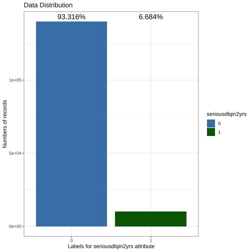
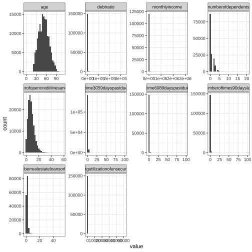
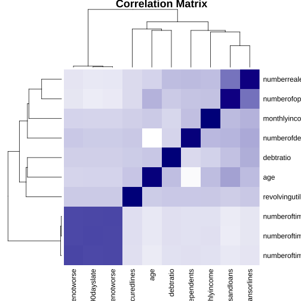
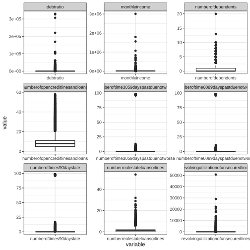

```r
# Exploratory Data Analysis (EDA)
```

```r
setwd("/Users/cailiying/Desktop/cuhk bsc/23:24/23:24 T2/STAT3011/Project2")
library(dlookr)
library(tidyverse)
library(ggcorrplot)
library(patchwork)
# Data Preprocessing
#Read the CSV file
training_data <- read_csv("cs-training.csv")
```

```
## New names:
## Rows: 150000 Columns: 12
## ── Column specification
## ────────────────────────────────────────────────────────────────────────── Delimiter: "," dbl
## (12): ...1, SeriousDlqin2yrs, RevolvingUtilizationOfUnsecuredLines, age, NumberOfTime30-59...
## ℹ Use `spec()` to retrieve the full column specification for this data. ℹ Specify the column
## types or set `show_col_types = FALSE` to quiet this message.
## • `` -> `...1`
```

```r
glimpse(training_data)
```

```
## Rows: 150,000
## Columns: 12
## $ ...1                                   <dbl> 1, 2, 3, 4, 5, 6, 7, 8, 9, 10, 11, 12, 13, 14, 15…
## $ SeriousDlqin2yrs                       <dbl> 1, 0, 0, 0, 0, 0, 0, 0, 0, 0, 0, 0, 0, 1, 0, 0, 0…
## $ RevolvingUtilizationOfUnsecuredLines   <dbl> 0.76612661, 0.95715102, 0.65818014, 0.23380978, 0…
## $ age                                    <dbl> 45, 40, 38, 30, 49, 74, 57, 39, 27, 57, 30, 51, 4…
## $ `NumberOfTime30-59DaysPastDueNotWorse` <dbl> 2, 0, 1, 0, 1, 0, 0, 0, 0, 0, 0, 0, 0, 3, 0, 0, 0…
## $ DebtRatio                              <dbl> 8.029821e-01, 1.218762e-01, 8.511338e-02, 3.60496…
## $ MonthlyIncome                          <dbl> 9120, 2600, 3042, 3300, 63588, 3500, NA, 3500, NA…
## $ NumberOfOpenCreditLinesAndLoans        <dbl> 13, 4, 2, 5, 7, 3, 8, 8, 2, 9, 5, 7, 13, 9, 6, 7,…
## $ NumberOfTimes90DaysLate                <dbl> 0, 0, 1, 0, 0, 0, 0, 0, 0, 0, 0, 0, 0, 3, 0, 0, 0…
## $ NumberRealEstateLoansOrLines           <dbl> 6, 0, 0, 0, 1, 1, 3, 0, 0, 4, 0, 2, 2, 1, 1, 1, 2…
## $ `NumberOfTime60-89DaysPastDueNotWorse` <dbl> 0, 0, 0, 0, 0, 0, 0, 0, 0, 0, 0, 0, 0, 1, 0, 0, 0…
## $ NumberOfDependents                     <dbl> 2, 1, 0, 0, 0, 1, 0, 0, NA, 2, 0, 2, 2, 2, 0, 2, …
```

```r
#Drop the column (Unnamed: 0)
training_data <- training_data[,-1]

#Clean the column names
colnames(training_data) <- gsub("-", "", tolower(colnames(training_data)))

head(training_data)
```

```
## # A tibble: 6 × 11
##   seriousdlqin2yrs revolvingutilizationofun…¹   age numberoftime3059days…² debtratio monthlyincome
##              <dbl>                      <dbl> <dbl>                  <dbl>     <dbl>         <dbl>
## 1                1                      0.766    45                      2    0.803           9120
## 2                0                      0.957    40                      0    0.122           2600
## 3                0                      0.658    38                      1    0.0851          3042
## 4                0                      0.234    30                      0    0.0360          3300
## 5                0                      0.907    49                      1    0.0249         63588
## 6                0                      0.213    74                      0    0.376           3500
## # ℹ abbreviated names: ¹​revolvingutilizationofunsecuredlines,
## #   ²​numberoftime3059dayspastduenotworse
## # ℹ 5 more variables: numberofopencreditlinesandloans <dbl>, numberoftimes90dayslate <dbl>,
## #   numberrealestateloansorlines <dbl>, numberoftime6089dayspastduenotworse <dbl>,
## #   numberofdependents <dbl>
```

```r
#Compute descriptive statistics
df <- training_data[, 2:ncol(training_data)]
properties <- summary(df)
(std_dev <- apply(df, 2, sd))
```

```
## revolvingutilizationofunsecuredlines                                  age 
##                           249.755371                            14.771866 
##  numberoftime3059dayspastduenotworse                            debtratio 
##                             4.192781                          2037.818523 
##                        monthlyincome      numberofopencreditlinesandloans 
##                                   NA                             5.145951 
##              numberoftimes90dayslate         numberrealestateloansorlines 
##                             4.169304                             1.129771 
##  numberoftime6089dayspastduenotworse                   numberofdependents 
##                             4.155179                                   NA
```

```r
(non_missing_counts <- colSums(!is.na(df)))
```

```
## revolvingutilizationofunsecuredlines                                  age 
##                               150000                               150000 
##  numberoftime3059dayspastduenotworse                            debtratio 
##                               150000                               150000 
##                        monthlyincome      numberofopencreditlinesandloans 
##                               120269                               150000 
##              numberoftimes90dayslate         numberrealestateloansorlines 
##                               150000                               150000 
##  numberoftime6089dayspastduenotworse                   numberofdependents 
##                               150000                               146076
```

```r
(means<-properties[4,])
```

```
## revolvingutilizationofunsecuredlines                                  age 
##                 "Mean   :    6.05  "                    "Mean   : 52.3  " 
##  numberoftime3059dayspastduenotworse                            debtratio 
##                   "Mean   : 0.421  "                 "Mean   :   353.0  " 
##                        monthlyincome      numberofopencreditlinesandloans 
##                  "Mean   :   6670  "                   "Mean   : 8.453  " 
##              numberoftimes90dayslate         numberrealestateloansorlines 
##                   "Mean   : 0.266  "                   "Mean   : 1.018  " 
##  numberoftime6089dayspastduenotworse                   numberofdependents 
##                  "Mean   : 0.2404  "                   "Mean   : 0.757  "
```

```r
(medians<-properties[3,])
```

```
## revolvingutilizationofunsecuredlines                                  age 
##                 "Median :    0.15  "                    "Median : 52.0  " 
##  numberoftime3059dayspastduenotworse                            debtratio 
##                   "Median : 0.000  "                 "Median :     0.4  " 
##                        monthlyincome      numberofopencreditlinesandloans 
##                  "Median :   5400  "                   "Median : 8.000  " 
##              numberoftimes90dayslate         numberrealestateloansorlines 
##                   "Median : 0.000  "                   "Median : 1.000  " 
##  numberoftime6089dayspastduenotworse                   numberofdependents 
##                  "Median : 0.0000  "                   "Median : 0.000  "
```

```r
#Calculate the total length of the training data
total_len <- length(training_data$seriousdlqin2yrs)

#Calculate the percentage of each category in the target label
percentage_labels <- prop.table(table(training_data$seriousdlqin2yrs)) * 100

#Print the percentage labels
print(percentage_labels)
```

```
## 
##      0      1 
## 93.316  6.684
```

```r
library(ggplot2)
training_data$seriousdlqin2yrs <- as.factor(training_data$seriousdlqin2yrs)

#Define custom colors for each bar
bar_colors <- c("steelblue", "darkgreen")

#Create the countplot with different colors for each bar
plot <- ggplot(training_data, aes(x = seriousdlqin2yrs, fill = seriousdlqin2yrs)) +
  geom_bar() +
  scale_fill_manual(values = bar_colors) +
  labs(title = "Data Distribution",
       x = "Labels for seriousdlqin2yrs attribute",
       y = "Numbers of records") +
  theme_bw()

#Create a data frame with label values for each bar
label_data <- data.frame(
  seriousdlqin2yrs = levels(training_data$seriousdlqin2yrs),
  label = c(93.316, 6.684) / 100  # Specify the label values for each bar as percentages
)

#Compute the maximum bar height
max_height <- max(table(training_data$seriousdlqin2yrs))

#Add labels to the plot
plot_with_labels <- plot +
  geom_text(data = label_data,
            aes(label = paste0(label * 100, "%"), fill = seriousdlqin2yrs),
            y = max_height, vjust = -0.5, size = 5, position = position_stack(vjust = 0.5))
```

```
## Warning in geom_text(data = label_data, aes(label = paste0(label * 100, : Ignoring unknown
## aesthetics: fill
```

```r
#Display the plot
print(plot_with_labels)
```

```
## Warning: Stacking requires either the ymin and ymin or the y aesthetics
## ℹ Maybe you want `position = "identity"`?
```



```r
colSums(is.na(training_data))
```

```
##                     seriousdlqin2yrs revolvingutilizationofunsecuredlines 
##                                    0                                    0 
##                                  age  numberoftime3059dayspastduenotworse 
##                                    0                                    0 
##                            debtratio                        monthlyincome 
##                                    0                                29731 
##      numberofopencreditlinesandloans              numberoftimes90dayslate 
##                                    0                                    0 
##         numberrealestateloansorlines  numberoftime6089dayspastduenotworse 
##                                    0                                    0 
##                   numberofdependents 
##                                 3924
```

```r
# MISSING VALUES
#Calculate the count of missing values in each attribute
missing_counts <- colSums(is.na(training_data))

#Create a data frame with x and y values
missing_data <- data.frame(attributes = names(missing_counts),
                           missing_count = missing_counts)

#Create the bar plot
bar_colors <- c("steelblue","black","darkgreen", "pink","blue","green","grey","yellow","purple","orange","darkorange")
plot <- ggplot(missing_data, aes(x = attributes, y = missing_count, fill = attributes)) +
  geom_bar(stat = "identity") +
  scale_fill_manual(values = bar_colors) +
  labs(title = "Missing Data",
       x = "Data Attributes",
       y = "Count of Missing Records") +
  theme(axis.text.x = element_text(angle = 90, hjust = 1))  # Rotate x-axis labels if needed

#Add labels to the plot
plot_with_labels <- plot +
  geom_text(aes(label = missing_count), vjust = -0.5, size = 3)

#Display the plot
print(plot_with_labels)
```



```r
#Install and load the 'zoo' package
library(zoo)

#Identify numeric columns
numeric_cols <- sapply(training_data, is.numeric)

#Replace missing values in numeric columns with column means
training_data_mean_replace <- training_data
training_data_mean_replace[, numeric_cols] <- na.aggregate(training_data[, numeric_cols], FUN = mean)

#Display the updated data frame
head(training_data_mean_replace)
```

```
## # A tibble: 6 × 11
##   seriousdlqin2yrs revolvingutilizationofun…¹   age numberoftime3059days…² debtratio monthlyincome
##   <fct>                                 <dbl> <dbl>                  <dbl>     <dbl>         <dbl>
## 1 1                                     0.766    45                      2    0.803           9120
## 2 0                                     0.957    40                      0    0.122           2600
## 3 0                                     0.658    38                      1    0.0851          3042
## 4 0                                     0.234    30                      0    0.0360          3300
## 5 0                                     0.907    49                      1    0.0249         63588
## 6 0                                     0.213    74                      0    0.376           3500
## # ℹ abbreviated names: ¹​revolvingutilizationofunsecuredlines,
## #   ²​numberoftime3059dayspastduenotworse
## # ℹ 5 more variables: numberofopencreditlinesandloans <dbl>, numberoftimes90dayslate <dbl>,
## #   numberrealestateloansorlines <dbl>, numberoftime6089dayspastduenotworse <dbl>,
## #   numberofdependents <dbl>
```

```r
colSums(is.na(training_data_mean_replace))
```

```
##                     seriousdlqin2yrs revolvingutilizationofunsecuredlines 
##                                    0                                    0 
##                                  age  numberoftime3059dayspastduenotworse 
##                                    0                                    0 
##                            debtratio                        monthlyincome 
##                                    0                                    0 
##      numberofopencreditlinesandloans              numberoftimes90dayslate 
##                                    0                                    0 
##         numberrealestateloansorlines  numberoftime6089dayspastduenotworse 
##                                    0                                    0 
##                   numberofdependents 
##                                    0
```

```r
#Actual replacement of the missing value using median value.
training_data_median_replace <- training_data
training_data_median_replace[, numeric_cols] <- na.aggregate(training_data[, numeric_cols], FUN = median)
head(training_data_median_replace)
```

```
## # A tibble: 6 × 11
##   seriousdlqin2yrs revolvingutilizationofun…¹   age numberoftime3059days…² debtratio monthlyincome
##   <fct>                                 <dbl> <dbl>                  <dbl>     <dbl>         <dbl>
## 1 1                                     0.766    45                      2    0.803           9120
## 2 0                                     0.957    40                      0    0.122           2600
## 3 0                                     0.658    38                      1    0.0851          3042
## 4 0                                     0.234    30                      0    0.0360          3300
## 5 0                                     0.907    49                      1    0.0249         63588
## 6 0                                     0.213    74                      0    0.376           3500
## # ℹ abbreviated names: ¹​revolvingutilizationofunsecuredlines,
## #   ²​numberoftime3059dayspastduenotworse
## # ℹ 5 more variables: numberofopencreditlinesandloans <dbl>, numberoftimes90dayslate <dbl>,
## #   numberrealestateloansorlines <dbl>, numberoftime6089dayspastduenotworse <dbl>,
## #   numberofdependents <dbl>
```

```r
colSums(is.na(training_data_median_replace))
```

```
##                     seriousdlqin2yrs revolvingutilizationofunsecuredlines 
##                                    0                                    0 
##                                  age  numberoftime3059dayspastduenotworse 
##                                    0                                    0 
##                            debtratio                        monthlyincome 
##                                    0                                    0 
##      numberofopencreditlinesandloans              numberoftimes90dayslate 
##                                    0                                    0 
##         numberrealestateloansorlines  numberoftime6089dayspastduenotworse 
##                                    0                                    0 
##                   numberofdependents 
##                                    0
```

```r
# CORRELATION
(correlation_matrix <- cor(training_data_median_replace[, 2:ncol(training_data)]))
```

```
##                                      revolvingutilizationofunsecuredlines          age
## revolvingutilizationofunsecuredlines                          1.000000000 -0.005898183
## age                                                          -0.005898183  1.000000000
## numberoftime3059dayspastduenotworse                          -0.001313501 -0.062995158
## debtratio                                                     0.003961205  0.024187804
## monthlyincome                                                 0.006512941  0.027580965
## numberofopencreditlinesandloans                              -0.011280733  0.147705318
## numberoftimes90dayslate                                      -0.001061246 -0.061004708
## numberrealestateloansorlines                                  0.006234713  0.033150273
## numberoftime6089dayspastduenotworse                          -0.001047827 -0.057159464
## numberofdependents                                            0.001193081 -0.215693475
##                                      numberoftime3059dayspastduenotworse    debtratio
## revolvingutilizationofunsecuredlines                        -0.001313501  0.003961205
## age                                                         -0.062995158  0.024187804
## numberoftime3059dayspastduenotworse                          1.000000000 -0.006541923
## debtratio                                                   -0.006541923  1.000000000
## monthlyincome                                               -0.008369555 -0.018006093
## numberofopencreditlinesandloans                             -0.055312236  0.049565286
## numberoftimes90dayslate                                      0.983602681 -0.008319640
## numberrealestateloansorlines                                -0.030564535  0.120046028
## numberoftime6089dayspastduenotworse                          0.987005447 -0.007533099
## numberofdependents                                          -0.004589553 -0.044475793
##                                      monthlyincome numberofopencreditlinesandloans
## revolvingutilizationofunsecuredlines   0.006512941                     -0.01128073
## age                                    0.027580965                      0.14770532
## numberoftime3059dayspastduenotworse   -0.008369555                     -0.05531224
## debtratio                             -0.018006093                      0.04956529
## monthlyincome                          1.000000000                      0.08694924
## numberofopencreditlinesandloans        0.086949236                      1.00000000
## numberoftimes90dayslate               -0.010500476                     -0.07998435
## numberrealestateloansorlines           0.116272621                      0.43395860
## numberoftime6089dayspastduenotworse   -0.009251981                     -0.07107673
## numberofdependents                     0.066313744                      0.07402646
##                                      numberoftimes90dayslate numberrealestateloansorlines
## revolvingutilizationofunsecuredlines            -0.001061246                  0.006234713
## age                                             -0.061004708                  0.033150273
## numberoftime3059dayspastduenotworse              0.983602681                 -0.030564535
## debtratio                                       -0.008319640                  0.120046028
## monthlyincome                                   -0.010500476                  0.116272621
## numberofopencreditlinesandloans                 -0.079984350                  0.433958603
## numberoftimes90dayslate                          1.000000000                 -0.045205216
## numberrealestateloansorlines                    -0.045205216                  1.000000000
## numberoftime6089dayspastduenotworse              0.992796183                 -0.039722332
## numberofdependents                              -0.011962420                  0.129399398
##                                      numberoftime6089dayspastduenotworse numberofdependents
## revolvingutilizationofunsecuredlines                        -0.001047827        0.001193081
## age                                                         -0.057159464       -0.215693475
## numberoftime3059dayspastduenotworse                          0.987005447       -0.004589553
## debtratio                                                   -0.007533099       -0.044475793
## monthlyincome                                               -0.009251981        0.066313744
## numberofopencreditlinesandloans                             -0.071076735        0.074026457
## numberoftimes90dayslate                                      0.992796183       -0.011962420
## numberrealestateloansorlines                                -0.039722332        0.129399398
## numberoftime6089dayspastduenotworse                          1.000000000       -0.012678189
## numberofdependents                                          -0.012678189        1.000000000
```

```r
#Load the 'stats' package
library(stats)

#Install and load the 'gplots' package
library(gplots)

#Create a heatmap using modified options
heatmap(correlation_matrix,
        col = colorRampPalette(c("white", "darkblue"))(256),
        main = "Correlation Matrix",
        cex.main = 1.5,   # Increase the font size of the main title
        cex.axis = 1.2,   # Increase the font size of the axes labels
        cex.lab = 1.2,    # Increase the font size of the colorbar labels
        keysize = 1.5,    # Increase the size of the colorbar
        key.title = "",   # Remove the colorbar title
        key.axes = FALSE) # Remove the colorbar axes
```

```
## Warning in plot.window(...): "keysize" is not a graphical parameter
```

```
## Warning in plot.window(...): "key.title" is not a graphical parameter
```

```
## Warning in plot.window(...): "key.axes" is not a graphical parameter
```

```
## Warning in plot.xy(xy, type, ...): "keysize" is not a graphical parameter
```

```
## Warning in plot.xy(xy, type, ...): "key.title" is not a graphical parameter
```

```
## Warning in plot.xy(xy, type, ...): "key.axes" is not a graphical parameter
```

```
## Warning in title(...): "keysize" is not a graphical parameter
```

```
## Warning in title(...): "key.title" is not a graphical parameter
```

```
## Warning in title(...): "key.axes" is not a graphical parameter
```



```r
# Add
glimpse(training_data_median_replace)
```

```
## Rows: 150,000
## Columns: 11
## $ seriousdlqin2yrs                     <fct> 1, 0, 0, 0, 0, 0, 0, 0, 0, 0, 0, 0, 0, 1, 0, 0, 0, …
## $ revolvingutilizationofunsecuredlines <dbl> 0.76612661, 0.95715102, 0.65818014, 0.23380978, 0.9…
## $ age                                  <dbl> 45, 40, 38, 30, 49, 74, 57, 39, 27, 57, 30, 51, 46,…
## $ numberoftime3059dayspastduenotworse  <dbl> 2, 0, 1, 0, 1, 0, 0, 0, 0, 0, 0, 0, 0, 3, 0, 0, 0, …
## $ debtratio                            <dbl> 8.029821e-01, 1.218762e-01, 8.511338e-02, 3.604968e…
## $ monthlyincome                        <dbl> 9120, 2600, 3042, 3300, 63588, 3500, 5400, 3500, 54…
## $ numberofopencreditlinesandloans      <dbl> 13, 4, 2, 5, 7, 3, 8, 8, 2, 9, 5, 7, 13, 9, 6, 7, 1…
## $ numberoftimes90dayslate              <dbl> 0, 0, 1, 0, 0, 0, 0, 0, 0, 0, 0, 0, 0, 3, 0, 0, 0, …
## $ numberrealestateloansorlines         <dbl> 6, 0, 0, 0, 1, 1, 3, 0, 0, 4, 0, 2, 2, 1, 1, 1, 2, …
## $ numberoftime6089dayspastduenotworse  <dbl> 0, 0, 0, 0, 0, 0, 0, 0, 0, 0, 0, 0, 0, 1, 0, 0, 0, …
## $ numberofdependents                   <dbl> 2, 1, 0, 0, 0, 1, 0, 0, 0, 2, 0, 2, 2, 2, 0, 2, 0, …
```

```r
#Computes the statistics of all numerical variables 
describe(training_data_median_replace)
```

```
## # A tibble: 10 × 26
##    described_variables        n    na    mean     sd se_mean     IQR skewness kurtosis   p00   p01
##    <chr>                  <int> <int>   <dbl>  <dbl>   <dbl>   <dbl>    <dbl>    <dbl> <dbl> <dbl>
##  1 revolvingutilizationo… 1.5e5     0 6.05e+0 2.50e2 6.45e-1 5.29e-1   97.6    1.45e+4     0     0
##  2 age                    1.5e5     0 5.23e+1 1.48e1 3.81e-2 2.2 e+1    0.189 -4.95e-1     0    24
##  3 numberoftime3059daysp… 1.5e5     0 4.21e-1 4.19e0 1.08e-2 0         22.6    5.22e+2     0     0
##  4 debtratio              1.5e5     0 3.53e+2 2.04e3 5.26e+0 6.93e-1   95.2    1.37e+4     0     0
##  5 monthlyincome          1.5e5     0 6.42e+3 1.29e4 3.33e+1 3.50e+3  127.     2.43e+4     0     0
##  6 numberofopencreditlin… 1.5e5     0 8.45e+0 5.15e0 1.33e-2 6   e+0    1.22   3.09e+0     0     0
##  7 numberoftimes90daysla… 1.5e5     0 2.66e-1 4.17e0 1.08e-2 0         23.1    5.38e+2     0     0
##  8 numberrealestateloans… 1.5e5     0 1.02e+0 1.13e0 2.92e-3 2   e+0    3.48   6.05e+1     0     0
##  9 numberoftime6089daysp… 1.5e5     0 2.40e-1 4.16e0 1.07e-2 0         23.3    5.46e+2     0     0
## 10 numberofdependents     1.5e5     0 7.37e-1 1.11e0 2.86e-3 1   e+0    1.63   3.14e+0     0     0
## # ℹ 15 more variables: p05 <dbl>, p10 <dbl>, p20 <dbl>, p25 <dbl>, p30 <dbl>, p40 <dbl>,
## #   p50 <dbl>, p60 <dbl>, p70 <dbl>, p75 <dbl>, p80 <dbl>, p90 <dbl>, p95 <dbl>, p99 <dbl>,
## #   p100 <dbl>
```

```r
df <- training_data_median_replace
df_numeric <- df %>% 
  ##select all numeric column
  select(where(is.numeric))

df_numeric %>% 
  pivot_longer(everything(),names_to = "variable",values_to = "value") %>% 
  ggplot(aes(x=value))+
  geom_histogram()+
  facet_wrap(~variable,scales = "free")+
  theme_bw()
```

```
## `stat_bin()` using `bins = 30`. Pick better value with `binwidth`.
```


```r
# Create a new column 'category_pastdue' to store the classification
df$category_pastdue <- apply(df[, c('numberoftime3059dayspastduenotworse', 
                                    'numberoftime6089dayspastduenotworse', 
                                    'numberoftimes90dayslate')], 1, function(x) {
  # Calculate the total number of past due occurrences
  total_past_due <- x['numberoftime3059dayspastduenotworse'] + 
    x['numberoftime6089dayspastduenotworse'] + x['numberoftimes90dayslate']
  # Calculate the proportion for each time frame
  prop_3059 <- ifelse(is.na(x['numberoftime3059dayspastduenotworse'] / total_past_due), 0, 
                      x['numberoftime3059dayspastduenotworse'] / total_past_due)
  prop_6089 <- ifelse(is.na(x['numberoftime6089dayspastduenotworse'] / total_past_due), 0, 
                      x['numberoftime6089dayspastduenotworse'] / total_past_due)
  prop_90plus <- ifelse(is.na(x['numberoftimes90dayslate'] / total_past_due), 0, 
                        x['numberoftimes90dayslate'] / total_past_due)
  if (prop_3059 == 0 & 
      prop_6089 == 0 & 
      prop_90plus == 0) {
    return('No Past Due')
  } else {
    # Classify based on the proportions
    if (prop_3059 > 0.5) {
      return('Mostly 30-59 Days Past Due')
    } else if (prop_6089 > 0.3) {
      return('Mostly 60-89 Days Past Due')
    } else {
      return('Mostly 90 days/+ Past Due')
    }
  }
})

table(df$category_pastdue)
```

```
## 
## Mostly 30-59 Days Past Due Mostly 60-89 Days Past Due  Mostly 90 days/+ Past Due 
##                      19316                       5450                       5597 
##                No Past Due 
##                     119637
```

```r
# remove three columns
df <- subset(df, select = -c(numberoftime3059dayspastduenotworse, numberoftime6089dayspastduenotworse, numberoftimes90dayslate))

df_chr <- df %>% 
  select(where(is.character))
df_chr %>% 
  pivot_longer(everything(),names_to = "variable",values_to = "value") %>% 
  ggplot(aes(x=value))+
  geom_bar()+
  facet_wrap(~variable,scales = "free")+
  theme_bw()
# have extreme values


knitr::spin("eda00000.R")
```

```
## 
## 
## processing file: eda00000.Rmd
```

```
## 
  |                                                                            
  |                                                                      |   0%
  |                                                                            
  |..................                                                    |  25%                  
  |                                                                            
  |...................................                                   |  50% [unnamed-chunk-4]
  |                                                                            
  |....................................................                  |  75% [unnamed-chunk-5]
```

```
## Warning in doTryCatch(return(expr), name, parentenv, handler): "keysize" is not a graphical
## parameter
```

```
## Warning in doTryCatch(return(expr), name, parentenv, handler): "key.title" is not a graphical
## parameter
```

```
## Warning in doTryCatch(return(expr), name, parentenv, handler): "key.axes" is not a graphical
## parameter
```

```
## Warning in doTryCatch(return(expr), name, parentenv, handler): "keysize" is not a graphical
## parameter
```

```
## Warning in doTryCatch(return(expr), name, parentenv, handler): "key.title" is not a graphical
## parameter
```

```
## Warning in doTryCatch(return(expr), name, parentenv, handler): "key.axes" is not a graphical
## parameter
```

```
## Warning in doTryCatch(return(expr), name, parentenv, handler): "keysize" is not a graphical
## parameter
```

```
## Warning in doTryCatch(return(expr), name, parentenv, handler): "key.title" is not a graphical
## parameter
```

```
## Warning in doTryCatch(return(expr), name, parentenv, handler): "key.axes" is not a graphical
## parameter
```

```
## 
  |                                                                            
  |......................................................................| 100%                  
```

```
## output file: eda00000.md
```

```
## Warning in file.remove(outsrc): cannot remove file 'eda00000.Rmd', reason 'No such file or
## directory'
```



